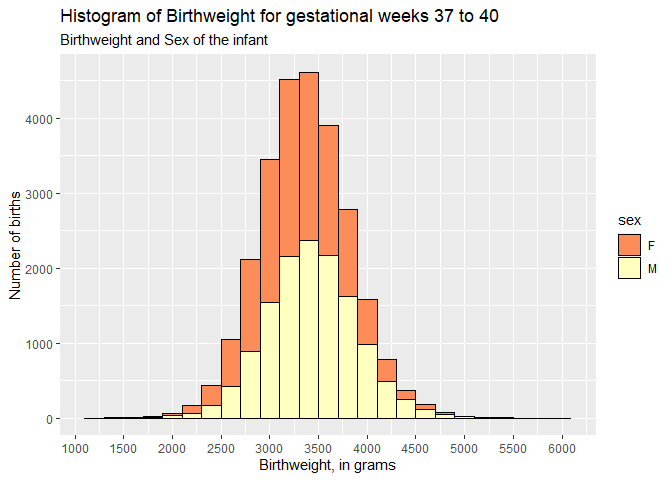
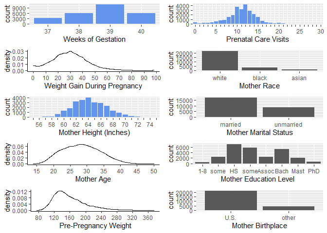

Data Mining Final Project
================
Anuka Revi Maria Gilbert
4/13/2021

# **Part I**

\-**Preparation and pre-processing of the data:**

NBER has a collection of vital statistics birth microdata which contains
birth certificate data from a given calendar year, in our case 2018. We
chose appropriate variables for our analysis which included BMI, height,
race and education of mother, as well as some pregnancy associated
characteristics. Prior analysis, we converted categorical variables into
factors and encoded them with the help of the codebook provided for this
dataset. We replaced unknown variables that were coded as 99, 999, or
9999 with NA values and renamed variables to make more intuitive for
readers. Since we were interested in birthweight outcome, we decided to
filter the data and focus on babies who were born on 37 to 40 weeks
mark, since there is a causal relationship between week of gestation and
the potential birthweight outcome. As we would expect, babies who are
born at 37-40 weeks mark weigh more than premature babies.

\-**Missing Data:**

In our data *week37to40* we have 2134 missing values which is small
compared to total 1159808 observed values, mother\_race contains 2061
missing values and mothers education contains 73 missing values. Since
NA values are than than 10% of our data set it makes sense to just
eliminate them.

\-**Visualizing birthright distribution**

By visualizing the data, we see that there are some variables that are
strongly related to one another, such as mother age with fathers age and
BMI with pre-pregnancy weight. None of the variables are strongly
correlated with birthright which is our variable of interest.

``` r
#histogram of baby weight for gestational weeks 37-40
g <- ggplot(week37to40, aes(birth_weight)) + scale_fill_brewer(palette = "Spectral")

g + geom_histogram(aes(fill=sex),
                   binwidth = 200,
                   col="black",
                   
) + labs(title="Histogram of Birthweight for gestational weeks 37 to 40",
         subtitle="Birthweight and Sex of the infant")  + scale_x_continuous(name="Birthweight, in grams",breaks=seq(0,6000,500)) + scale_y_continuous(name="Number of births",breaks=seq(0,9000,1000))
```


``` r
#correlation for variables 
num_cols <- unlist(lapply(week37to40, is.numeric))         # Identify numeric columns
data_num <- week37to40[, num_cols]   
data_num<-na.omit(data_num)


corr<-cor(data_num,use="pairwise.complete.obs")%>%round(2)


ggcorrplot(corr, hc.order = FALSE,
           lab = TRUE, 
           lab_size = 3,
           method="square",
           colors = c("tomato2", "white", "springgreen3"), 
           title="Correlogram of birthweight variables", 
           ggtheme=theme_bw)
```


``` r
#summary(birthweight_new)


 
#skim(birthweight_new)
```

\-**Random Forest and XGBOOST**

Although the correlations are giving a good overview of the most
important numeric variables and multicolinerity among those variables, I
wanted to get an overview of the most important variables including the
categorical variables before moving on to visualization. Random Forest
allows us to find the variable importance without much effort or
parameter tuning but slightly longer than desired time. As we would
expect some of the most important variables are combined\_gestation,
weight gain during pregnancy, pre-pregnancy weight, mother’s BMI and
height, as well as mother’s race & age, prior live birth and sex of the
baby. RMSE of Random Forest model was 408.2254.

We also included the distribution of some of the most important
variables in determining the birthweight. Visualizing relationships
between birth\_weight and three most important variables - weight gain,
mother’s height in inches and mothers age we see non-linear
relationships. This made us speculate that non linear model might be a
best predictor for birth weight as numerical value so we decided to
employ KNN model.

``` r
##Random Forest 
set.seed(1234)
week37to40_split = initial_split(week37to40)
n = nrow(week37to40)
n_train = floor(0.8*n)
n_test = n - n_train
train_cases = sample.int(n, size=n_train, replace=FALSE)
week37to40_train = training(week37to40_split)
week37to40_test = testing(week37to40_split)


forest1 = randomForest(birth_weight ~ . - X - breastfed - under_37weeks - apgar5 - birth_time, distribution="gaussian",data=week37to40_train, n.trees=100, importance=TRUE)

imp_forest1<-importance(forest1)
imp_DF <- data.frame(Variables = row.names(imp_forest1), MSE = imp_forest1[,1])
imp_DF <- imp_DF[order(imp_DF$MSE, decreasing = TRUE),]

ggplot(imp_DF[1:20,], aes(x=reorder(Variables, MSE), y=MSE, fill=MSE)) + geom_bar(stat = 'identity') + labs(x = 'Variables', y= '% increase MSE if variable is randomly permuted') + coord_flip() + theme(legend.position="none")
```

<!-- -->

``` r
yhat_test = predict(forest1, week37to40_test)
rmse(forest1,week37to40_test)
```

    ## [1] 408.2254

``` r
#1] 408.2254
```

\-*Graphs to visualize relationship between some of most important
variables and birthweight*

``` r
library(hrbrthemes)


s1=ggplot(week37to40, aes(x=combined_gestation)) + 
    geom_density() +
    theme_classic()+ labs(x='Combined Gestation')

s2=ggplot(week37to40, aes(x=wtgain)) + 
    geom_density() +
    theme_classic()+ labs(x='Weightgain During Pregnancy')


s3=ggplot(week37to40, aes(x=m_ht_in)) + 
    geom_density() +
    theme_classic()+ labs(x='Mother Height (Inches)')


s4=ggplot(week37to40, aes(x=mother_age)) + 
    geom_density() +
    theme_classic()+ labs(x='Mother Age')


s5=ggplot(data=week37to40, aes(x=as.factor(mother_race))) +
        geom_histogram(stat='count') + labs(x='Mother Race')


source("http://peterhaschke.com/Code/multiplot.R")
multiplot(s1,s2,s3,s4,s5,cols=2)
```

<!-- -->

``` r
g1<-ggplot(data=week37to40, aes(x=combined_gestation, y=birth_weight))+
        geom_point(col="dodgerblue") + geom_smooth(method = "lm", se=FALSE, color="black") 
        
g2<-ggplot(data=week37to40, aes(x=wtgain, y=birth_weight))+
        geom_point(col="dodgerblue") + geom_smooth(method = "lm", se=FALSE, color="black") 
      

g3<-ggplot(data=week37to40, aes(x=prepreg_weight, y=birth_weight))+
        geom_point(col="dodgerblue") + geom_smooth(method = "lm", se=FALSE, color="black")


g4<-ggplot(data=week37to40, aes(x=m_ht_in, y=birth_weight))+
        geom_point(col="dodgerblue") + geom_smooth(method = "lm", se=FALSE, color="black")


source("http://peterhaschke.com/Code/multiplot.R")
multiplot(g1,g2,g3,g4,cols=2)
```

<!-- -->

## *Worflow that wont be all included in our final md draft*

We tried linear stepwise selection and Lasso glmnet models (*we have to
briefly explain how each model works*), and used RMSE as our evaluation
metrics on test set. Lasso glmnet gave us better prediction accuracy
with lower RMSE value of 13.25.

**Linear Model with Step Function**

  - **Lasso with glmnet**

<!-- end list -->

``` r
library(ISLR)
library(glmnet)
library(dplyr)
library(tidyr)


set.seed(1234)
y_train<-week37to40_train_uncorr%>%select(birth_weight)%>%
  unlist()%>%
  as.numeric()

y_test<-week37to40_test_uncorr%>%select(birth_weight)%>%
  unlist()%>%
  as.numeric()


x_train<-week37to40_train_uncorr %>% 
  data.matrix()

x_test<-week37to40_test_uncorr %>%
  data.matrix()


grid<-10^seq(10,-2,length=100)
  
  
#fit lasso model 
lasso_mod<-glmnet(x_train, y_train, alpha=1, lambda=grid)

plot(lasso_mod)  #draw plot of coefficients
```

<!-- -->

``` r
set.seed(12)
cv_fit<-cv.glmnet(x_train,y_train, alpha=1) #fit lasso on training data  #alpha=0 ->ridge model if 1 ->lasso model 


plot(cv_fit) #DRaw plot of training MSE as a fucntio of lambda
```

<!-- -->

``` r
opt_lambda<-cv_fit$lambda.min #select lambda that minimizes training mSE
print(paste("best labda value is", opt_lambda))
```

    ## [1] "best labda value is 13.361621717586"

``` r
lasso_pred<-predict(lasso_mod, s=opt_lambda, newx=x_test) #use best lambda to predict test data

rmse_test<-sqrt(mean((lasso_pred-y_test)^2))
print(paste("Test RMSE is", rmse_test))
```

    ## [1] "Test RMSE is 13.2547256741035"

``` r
#IDK why i cant get variable importance please ask your brother 
lassoVarImp <- varImp(lasso_mod,lambda=opt_lambda, scale=F)
lassoImportance <- lassoVarImp$importance

varsSelected <- length(which(lassoImportance$Overall!=0))
varsNotSelected <- length(which(lassoImportance$Overall==0))

cat('Lasso uses', varsSelected, 'variables in its model, and did not select', varsNotSelected, 'variables.')
```

    ## Lasso uses 0 variables in its model, and did not select 0 variables.

\*\*XGBOOST model for regression"

First objective was to predict exact birth weight for babies who are
born at 37 to 40 weeks gestation mark (which is counted as full term
pregnancy). Lasso model and tree models did that with higher accuracy
that step wise selection of OLS model,

The second goal was to predict whether babies born from 37 to 40 weeks
of gestation were underweight or not. For this binary outcome model we
used Xgboost that gave us low accuracy.

``` r
#Conversion from categorical to numerical values - one hot encoding

# 1. create new categorical variable fro moms age that are greater than 35 ( high risk pregnancy)
# 2. babies that are underweight VS not underweight
# 3. Grouping per 5 years  so that algorithm treats that as independent values thus 20 is not closer to 30 than 60. thus distance between ages is lost in this transformation

week37to40_new<-week37to40%>%
  mutate(underweight=as.factor(ifelse(birth_weight<2500, "underweight", "not underweight")),
         agediscrete=as.factor(round(mother_age/10,0)),
         risk=as.factor(ifelse(mother_age>35, "high risk", "low risk")))


#remove X because there is nothing to learn from X that stands as ID 

week37to40_new$X<-NULL

#train test split with caret 
set.seed(123)

week37to40_new_split = initial_split(week37to40_new)
nrow = nrow(week37to40_new)
n_train_new = floor(0.8*nrow)
n_test_new = nrow - n_train_new
train_cases = sample.int(nrow, size=n_train_new, replace=FALSE)
week37to40_new_train = training(week37to40_new_split)
week37to40_new_test = testing(week37to40_new_split)


#unlinke GLM that assumes that feautures are uncorrelated in order to predict more accurate outcomes. decision tree algorithms including boosted trees are robust to these feautures. thus we do nothave to worry about correlated feautures!


 # **ONE HOT ENCODING***
#transform categorical data to dummy variables (the purpose is to transform each value of the each categorical feauture into a binary feauture {0,1}.

sparse_matrix<-sparse.model.matrix(underweight~.-1, data = week37to40_new_train)
sparse_matrix_test<-sparse.model.matrix(underweight~.-1, data=week37to40_new_test)


#create output numeric vector (not as a sparse matrix)
output_vector=as.numeric(week37to40_new_train$underweight=="underweight")
output_vector_test=as.numeric(week37to40_new_test$underweight=="underweight")
 
  ##build the model
bst_boost<-xgboost(data=sparse_matrix, label=output_vector, max.depth=4, eta=0.2, nthread=2, nround=10, objective="binary:logistic")
```

    ## [00:34:38] WARNING: amalgamation/../src/learner.cc:1061: Starting in XGBoost 1.3.0, the default evaluation metric used with the objective 'binary:logistic' was changed from 'error' to 'logloss'. Explicitly set eval_metric if you'd like to restore the old behavior.
    ## [1]  train-logloss:0.513065 
    ## [2]  train-logloss:0.392122 
    ## [3]  train-logloss:0.305390 
    ## [4]  train-logloss:0.240795 
    ## [5]  train-logloss:0.191574 
    ## [6]  train-logloss:0.153371 
    ## [7]  train-logloss:0.123356 
    ## [8]  train-logloss:0.099602 
    ## [9]  train-logloss:0.080660 
    ## [10] train-logloss:0.065457

``` r
pred_boost<-predict(bst_boost, sparse_matrix_test)
err_boost<-as.numeric(sum(as.integer(pred_boost>0.5)!=output_vector_test))/length(output_vector_test)
print(paste("test-error=", err_boost))
```

    ## [1] "test-error= 0"

``` r
 #feature importance looks weird
 
importance_boost<-xgb.importance(model=bst_boost)

print(xgb.plot.importance(importance_matrix = importance_boost, top_n=10))
```

<!-- -->

    ##         Feature Gain Cover Frequency Importance
    ## 1: birth_weight    1     1         1          1

``` r
###I think bst_ boost is NOT  done correctly for predicting whether we had uderweight or overweight coz it sounds too good to be true test_error of 0. 

 
 #linear boosting
dtrain<-xgb.DMatrix(data=sparse_matrix, label=output_vector)
dtest<-xgb.DMatrix(data=sparse_matrix_test, label=output_vector_test)
bst_linear<-xgb.train(data=dtrain, booster="gblinear", nthread=2, nrounds=2, objective="binary:logistic")

pred<-predict(bst_linear, dtest)
err<-as.numeric(sum(as.integer(pred>0.5)!=output_vector_test))/length(output_vector_test)
print(paste("test-error=", err))
```

    ## [1] "test-error= 0.0255351681957187"

``` r
 #feature importance 
 
importance<-xgb.importance(colnames(dtrain), model=bst_linear)

print(xgb.plot.importance(importance_matrix = importance, top_n=10))
```

<!-- -->

    ##                     Feature    Weight Importance
    ##  1:                f_cigs_2 -0.702993  -0.702993
    ##  2:          gest_diabetesU -0.351823  -0.351823
    ##  3:            agediscrete5  0.296002   0.296002
    ##  4:          labor_inducedU -0.277592  -0.277592
    ##  5:        father_raceNHOPI -0.211190  -0.211190
    ##  6: hypertension_eclampsiaU -0.175912  -0.175912
    ##  7:             anesthesiaU -0.138796  -0.138796
    ##  8:        mother_raceblack  0.138096   0.138096
    ##  9:    hospitalNot Hospital -0.130089  -0.130089
    ## 10:        ruptured_uterusY -0.126891  -0.126891

``` r
#gain is the improvement in  accuracy brought by a feauture to the branches it is on, thei ide is that before adding a new spolit there was a wrongly classifid elements after adding a split on ths feauture there are 2 new branches  and each of these branch is more accurate. 
#Frequency is the number of times the feauture is used in all generated trees

## Improvements in the interpretability of feauture importance data table

#importanceRAW<-xgb.importance(feauture_name=sparse_matrix@Dimnames[[2]], model=bst_linear, data=sparse_matrix, label=output_vector)

#clean for better display
#importanceCLEAN<-importanceRAW[,":="(Cover=NULL, Frequency=NULL)]

#head(importanceCLEAN)
#head(importance)
```

# **Predicting Birthright for Babies**

## **Abstract**

summary of our questions, methods, results, and conclusions in a few 100
words

## **Introduction**

Baby announcements are sweet and memorable. Expecting parents usually
know their approximate due date at the beginning of the pregnancy and
learn about their baby’s gender at around 20 weeks mark. While gender
reveal, time of birth and name of the new baby are all exciting and
great news for the entire family to have, OB-GYNS mostly look at baby’s
development, growth and their weight. Estimating baby weight in
particular is very important, since a large size baby can pose serious
injuries to the baby and its mother. Ultrasounds are often used to
estimate baby’s weight, but they are not always accurate. When I was
over 40 weeks pregnant, my doctor told me that the baby was an average
size and I didnot need to be induced, however my daughter was born over
8.9lbs which was significantly larger than the estimated size and it
made my delivery more complicated. So While exploring my project ideas,
I came across to the NBER natality birth data from 2018 that contained
the features of the baby like birth date, gender, medical conditions of
the birth mother, number of children born etc. My goal is to predict the
birthright of the baby depending on the week of pregnancy. Better
estimations used by doctors should mean easier deliveries and less
complications and its interesting to see how machine learning tools
could help us estimate the birthweight.

## **Methods**

My dataset birthweight18.csv contains 50000 randomly chosen samples from
2018 U.S. data files
(<https://www.nber.org/research/data/vital-statistics-natality-birth-data>).
There are 42 variables that were chosen from the initial 142 variables
on the dataset.

## **Data Exploration**

## **Results**

tables figs and texst that illustrate your findings. (4 -6 figures and
tables do not incuudefog or table if you do not discuss it in a text)

## **Conclusion**

interpret what you founds, man lessons we should take away from your
report

## **Appendix**

optional. any details figs

-----

\#\#\#Data Worfklow
