ECO 395M: Exercise 1
====================

Data visualization: gas prices
------------------------------

This problem is about making simple plots and telling stories using
those plots.

For this exercise, you’ll need to download the `GasPrices.csv` data set
from the class website, which contains data from 101 gas stations in the
Austin area collected in 2016. There are lots of variables in this data
set, but for our purposes here, the important ones are as follows:

-   ID: Order in which gas stations were visited  
-   Name: Name of gas station  
-   Price: Price of regular unleaded gasoline, gathered on Sunday, April
    3rd, 2016  
-   Highway: Is the gas station accessible from either a highway or a
    highway access road?  
-   Stoplight: Is there a stoplight in front of the gas station?  
-   Competitors: Are there any other gas stations in sight?  
-   Zipcode: Zip code in which gas station is located  
-   Income: Median Household Income of the ZIP code where the gas
    station is located based on 2014 data from the U.S. Census Bureau  
-   Brand: ExxonMobil, ChevronTexaco, Shell, or Other.  
    \#\#\# The theories

eople have a lot of pet theories about what explains the variation in
prices between gas stations. Here are several such theories

***A) Gas stations charge more if they lack direct competition in sight
(boxplot)***

    library(tidyverse)

    ## -- Attaching packages --------------------------------------- tidyverse 1.3.0 --

    ## v ggplot2 3.3.3     v purrr   0.3.4
    ## v tibble  3.0.6     v dplyr   1.0.3
    ## v tidyr   1.1.2     v stringr 1.4.0
    ## v readr   1.4.0     v forcats 0.5.1

    ## -- Conflicts ------------------------------------------ tidyverse_conflicts() --
    ## x dplyr::filter() masks stats::filter()
    ## x dplyr::lag()    masks stats::lag()

    library(ggplot2)
    gasprices <- read.csv("C:/Users/anuka/Desktop/ECO395M/data/GasPrices.csv")

    ggplot(data=gasprices)+geom_boxplot(aes(x=factor(Competitors),y=Price))+
      labs(title = "Price With & W/O Competition",x="Price",y="Competition")

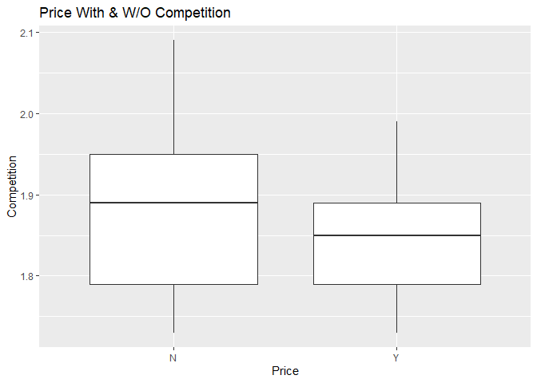

-   *Data shows that gas stations with direct competition charge less,
    number is closer to 1.85, while the price of the ones without
    competition is closer to 1.9.*

***B) The richer the area, the higher the gas price (scatter plot).***

    library(tidyverse)
    library(ggplot2)
    gasprices <- read.csv("C:/Users/anuka/Desktop/ECO395M/data/GasPrices.csv")

    ggplot(data=gasprices)+geom_point(aes(x= Income, y=Price, color=Brand))+
      scale_x_continuous(breaks=10000:90000)+labs(title="Gas Prices in Richer Neighborhoods", x="Median Household Income of the ZIP code",
           y="Gas Price")

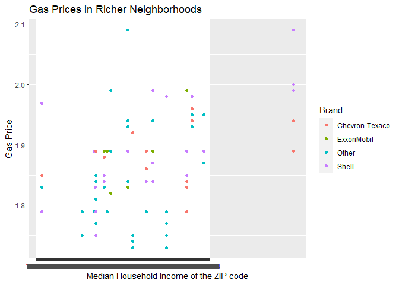

-   *This scatterplot confirms that richer the area, higher the gas
    prices*

***C) Shell charges more than other brands (bar plot)***

    library(tidyverse)
    library(ggplot2)
    gasprices <- read.csv("C:/Users/anuka/Desktop/ECO395M/data/GasPrices.csv")

    df_long<-gasprices%>%group_by(Brand)%>%
      summarize(price=mean(Price))%>%
      ggplot(aes(y=price,x=Brand, fill=Brand))+
      geom_col()+labs(title="Shell VS Other Brands", x="Brand",y="aerageprice")
    df_long

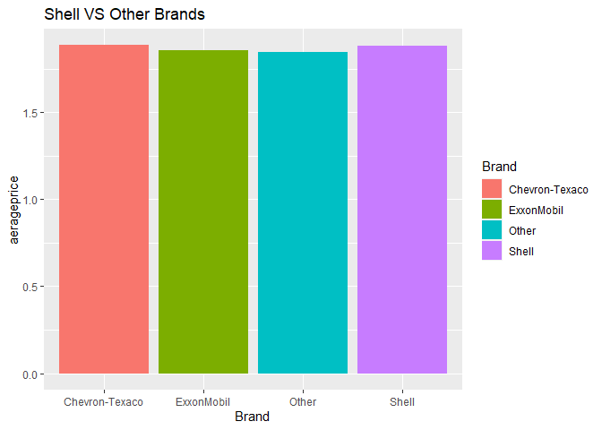
-*Shell does charge more than other gas companies, followed by
Chevros-Texaco.*

***D) Gas stations at stoplights charge more (faceted histogram).***

    library(tidyverse)
    library(ggplot2)
    gasprices <- read.csv("C:/Users/anuka/Desktop/ECO395M/data/GasPrices.csv")

    ggplot(data=gasprices)+geom_boxplot(aes(x=Brand,y=Price,fill=Brand))+
      facet_wrap(~Stoplight =="Y")

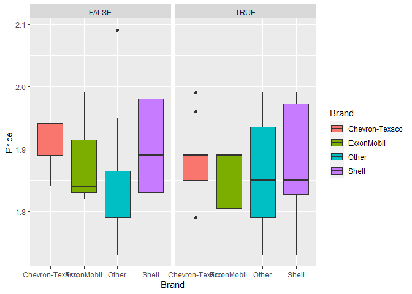

-   *This statement is not supported by data. While some companies
    charge more at spotlight, others do not and price variation within
    the companies themselves is high.*

***E) Gas stations with direct highway access charge more (your choice
of plot).***

    library(tidyverse)
    library(ggplot2)
    gasprices <- read.csv("C:/Users/anuka/Desktop/ECO395M/data/GasPrices.csv")
    ggplot(data=gasprices)+geom_boxplot(aes(x=Brand,y=Price,fill=Brand))+
      facet_wrap(~Highway =="Y")

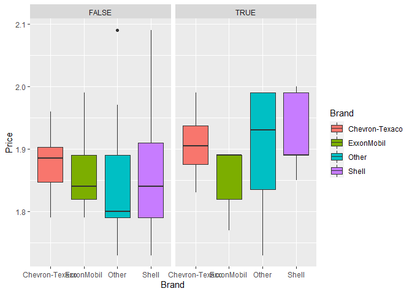

    gasprices %>% group_by(Brand, Highway) %>%
      summarize(price = mean(Price)) %>% ggplot(aes(x=Brand,y=price, fill=Brand))+geom_col()+facet_wrap(~ Highway =="Y")

    ## `summarise()` has grouped output by 'Brand'. You can override using the `.groups` argument.

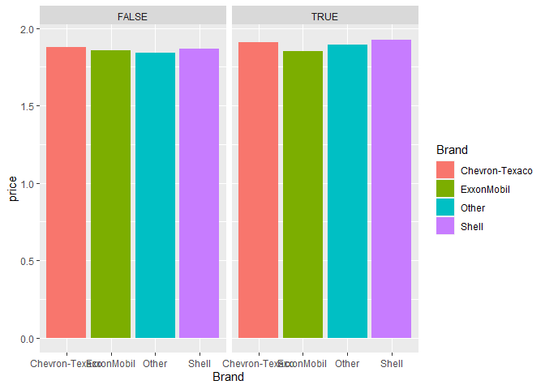
-*On average gas stations with direct highway access d charge more
according to the given data.*

2) Data visualization: a bike share network
-------------------------------------------

This problem continues the review of data exploration and visualization
using `ggplot2` and the `tidyverse` packages, but now asking you to
bring in multiple variables into a single plot.

Bike-sharing systems are a new generation of traditional bike rentals
where the whole process from rental to return is automatic. There are
thousands of municipal bike-sharing systems around the world (e.g. Citi
bikes in NYC or “Boris bikes” in London), and they have attracted a
great deal of interest because of their important role in traffic,
environmental, and health issues—especially in the wake of the COVID-19
pandemic, when ridership levels on public-transit systems have
plummeted.

These bike-sharing systems also generate a tremendous amount of data,
with time of travel, departure, and arrival position recorded for every
trip. This feature turns bike sharing system into a virtual sensor
network that can be used for sensing mobility patterns across a city.

Bike-sharing rental demand is highly correlated to environmental and
seasonal variables like weather conditions, day of week, time of year,
hour of the day, and so on. In this problem, you’ll look at some of
these demand-driving factors using the `bikeshare.csv` data. This data
set contains a two-year historical log (2011 and 2012) from the Capital
Bikeshare system in Washington D.C. The raw data is publicly available
at
<a href="http://capitalbikeshare.com/system-data" class="uri">http://capitalbikeshare.com/system-data</a>.
These data have been aggregated on an hourly and daily basis and then
merged with weather and seasonal data.

The variables in this data set are as follows:

-   instant: unique record identifier for each row

-   dteday: date

-   season: season (1:spring, 2:summer, 3:fall, 4:winter)

-   yr: year (0: 2011, 1:2012)

-   mnth: month (1 to 12)

-   hr: hour (0 to 23)

-   holiday: whether the day is holiday or not

-   weekday: day of the week (1 = Sunday)

-   workingday: if day is neither weekend nor holiday is 1, otherwise
    is 0.

-   weathersit: a weather situation code with the following values

    -   1: Clear, Few clouds, Partly cloudy, Partly cloudy
    -   2: Mist + Cloudy, Mist + Broken clouds, Mist + Few clouds, Mist
    -   3: Light Snow, Light Rain + Thunderstorm + Scattered clouds,
        Light Rain + Scattered clouds
    -   4: Heavy Rain + Ice Pallets + Thunderstorm + Mist, Snow + Fog

-   temp: Normalized temperature in Celsius. The actual values are
    divided by 41 (max)

-   total: count of total bike rentals that hour, including both casual
    and registered users

-   Plot A: a line graph showing average bike rentals (`total`) versus
    hour of the day (`hr`).

<!-- -->

    library(ggplot2)
    library(tidyverse)
    bikeshare <- read.csv("C:/Users/anuka/Desktop/ECO395M/data/bikeshare.csv")

    avg_bikeshare <- bikeshare %>%
    group_by(total,hr) %>%
    mutate (meantotal=mean(total)) %>%
      ggplot(aes(x=hr,y=meantotal))+
      geom_line(stat="summary",fun.y="mean")+
      geom_point()

    ## Warning: Ignoring unknown parameters: fun.y

    avg_bikeshare

    ## No summary function supplied, defaulting to `mean_se()`

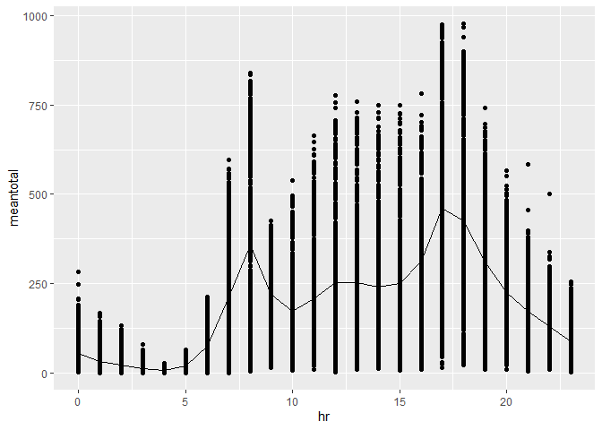

-*We see that average bikeshare number is the highest at 17:00 and
lowest at 4:00.*

-   Plot B: a faceted line graph showing average bike rentals versus
    hour of the day, faceted according

<!-- -->

    ggplot(data=bikeshare)+geom_line(aes(hr,total),stat="summary",fun.y="mean")+facet_wrap(~workingday)

    ## Warning: Ignoring unknown parameters: fun.y

    ## No summary function supplied, defaulting to `mean_se()`
    ## No summary function supplied, defaulting to `mean_se()`

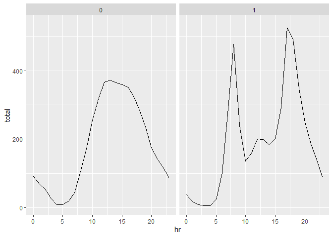

-*the peak for avg bike rental is between 7:00 and 17:00 for working day
but for non workingday its around 12*

-   Plot C: a faceted bar plot showing average ridership **during the 8
    AM hour** by weather situation code (`weathersit`), faceted
    according to whether it is a working day or not. Note: remember you
    can focus on a specific subset of rows of a data set using `filter`

<!-- -->

    bikeshare %>%
      filter(hr=="8") %>% ggplot()+geom_bar(aes(x=weathersit,y=total),stat="identity")+facet_wrap(~workingday)

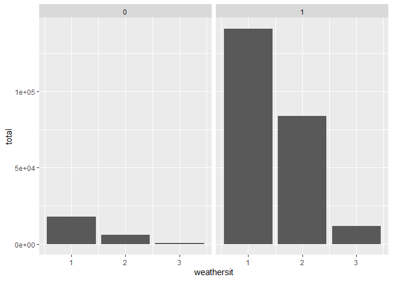

------------------------------------------------------------------------

3) Data visualization: flights at ABIA
--------------------------------------

This problem continues the themes of data exploration and data
visualization using `ggplot2` and the `tidyverse`, but is entirely
open-ended.

Consider the data in [ABIA.csv](../data/ABIA.csv), which contains
information on every commercial flight in 2008 that either departed from
or landed at Austin-Bergstrom Interational Airport. The variable
codebook is as follows:

-   Year all 2008  
-   Month 1-12  
-   DayofMonth 1-31
-   DayOfWeek 1 (Monday) - 7 (Sunday)
-   DepTime actual departure time (local, hhmm)
-   CRSDepTime scheduled departure time (local, hhmm)
-   ArrTime actual arrival time (local, hhmm)
-   CRSArrTime scheduled arrival time (local, hhmm)
-   UniqueCarrier unique carrier code
-   FlightNum flight number
-   TailNum plane tail number
-   ActualElapsedTime in minutes
-   CRSElapsedTime in minutes
-   AirTime in minutes
-   ArrDelay arrival delay, in minutes
-   DepDelay departure delay, in minutes
-   Origin origin IATA airport code
-   Dest destination IATA airport code
-   Distance in miles
-   TaxiIn taxi in time, in minutes
-   TaxiOut taxi out time in minutes
-   Cancelled was the flight cancelled?
-   CancellationCode reason for cancellation (A = carrier, B = weather,
    C = NAS, D = security)
-   Diverted 1 = yes, 0 = no
-   CarrierDelay in minutes
-   WeatherDelay in minutes
-   NASDelay in minutes
-   SecurityDelay in minutes  
-   LateAircraftDelay in minutes

Your task is to create a figure, or set of related figures, that tell an
interesting story about flights into and out of Austin.

-   *A)What is the best time of day to fly to minimize delays, and does
    this change by airline?*

<!-- -->

    ABIA <- read.csv("C:/Users/anuka/Desktop/ECO395M/data/ABIA.csv")
    #distribution of flight delays and cancellations by days of month
    flight_sum<-ABIA %>%
      #group flight cancellations & flight delays into one level
      mutate(delay =ifelse(DepDelay+ArrDelay>=15 | is.na(DepDelay) == T,1,0),carrier=factor(UniqueCarrier),
             origin=factor(Origin),
             day_of_week=factor(DayOfWeek))%>%
      select(delay,carrier,origin,day_of_week,Month,Year,DayofMonth,DepTime,Dest)

    head(flight_sum)

    flight_sum %>% filter(delay ==1) %>% group_by(DepTime) %>%
      summarize(n_delays=n()) %>%
      ggplot(aes(x=DepTime,y=n_delays))+geom_line(col="blue")+
      scale_y_continuous(limits = c(0, 100))

    ## Warning: Removed 1 row(s) containing missing values (geom_path).

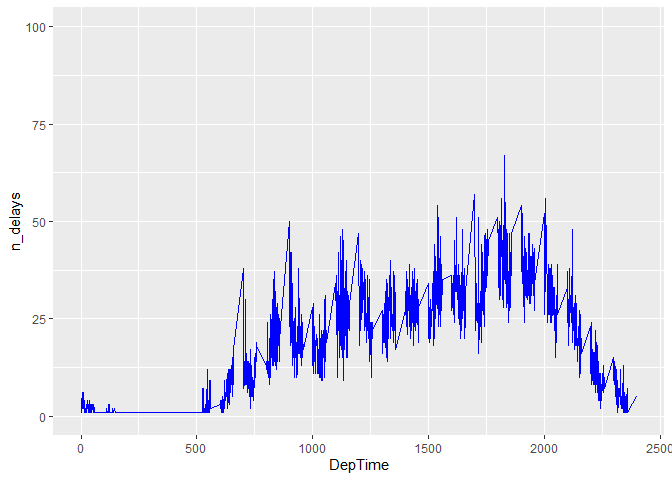

In the graph below, we see Departure time measured from 0-25 on X
coordinate and number of total delays (including canceled flights) on
the Y axis. We can see the best time of the day to fly is between 0 and
5:00

-*What is the best time of year to fly to minimize delays, and does this
change by destination? (You’d probably want to focus on a handful of
popular destinations.)*

    flight_sum %>% filter(delay == 1) %>%group_by(Month) %>%
      summarize(n_delays=n()) %>%
      ggplot(aes(x=Month,y=n_delays))+geom_bar(stat="identity")

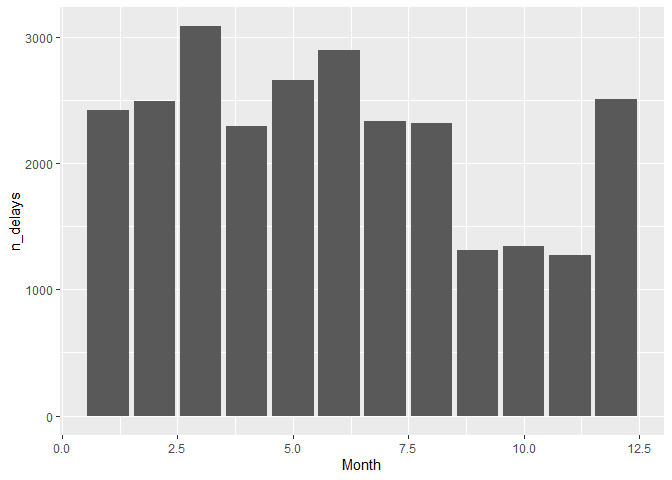

\#\#4 - *4) K-nearest neighbors *

The data in [sclass.csv](../data/sclass.csv) contains data on over
29,000 Mercedes S Class vehicles—essentially every such car in this
class that was advertised on the secondary automobile market during
2014. For websites like Cars.com or Truecar that aim to provide
market-based pricing information to consumers, the Mercedes S class is a
notoriously difficult case. There is a huge range of sub-models that are
all labeled “S Class,”" from large luxury sedans to high-performance
sports cars; one sub-category of S class even serves as the official
pace car in Formula 1 Races. Moreover, individual submodels involve cars
with many different features. This extreme diversity—unusual for a
single model of car—makes it difficult to provide accurate pricing
predictions to consumers.

We’ll revisit this data set later in the semester when we’ve got a
larger toolkit for building predictive models. For now, let’s focus on
three variables in particular: - trim: categorical variable for car’s
trim level, e.g. 350, 63 AMG, etc. The trim is like a sub-model
designation.  
- mileage: mileage on the car - price: the sales price in dollars of the
car

Your goal is to use K-nearest neighbors to build a predictive model for
price, given mileage, separately for each of two trim levels: 350 & 65
AMG. Your goal is to use K-nearest neighbors to build a predictive model
for price, given mileage, separately for each of two trim levels: 350 &
65 AMG.

    library(ggplot2)
    library(tidyverse)
    library(FNN)
    library(rsample)
    library(modelr)
    library(caret)

    ## Loading required package: lattice

    ## 
    ## Attaching package: 'caret'

    ## The following object is masked from 'package:purrr':
    ## 
    ##     lift

    library(parallel)
    library(foreach)

    ## 
    ## Attaching package: 'foreach'

    ## The following objects are masked from 'package:purrr':
    ## 
    ##     accumulate, when

    library(cluster)
    library(factorEx)

    ## Loading required package: arm

    ## Loading required package: MASS

    ## 
    ## Attaching package: 'MASS'

    ## The following object is masked from 'package:dplyr':
    ## 
    ##     select

    ## Loading required package: Matrix

    ## 
    ## Attaching package: 'Matrix'

    ## The following objects are masked from 'package:tidyr':
    ## 
    ##     expand, pack, unpack

    ## Loading required package: lme4

    ## 
    ## arm (Version 1.11-2, built: 2020-7-27)

    ## Working directory is C:/Users/anuka/Documents/GitHub/ECO394D/R/HW1

    ## Loading required package: genlasso

    ## Loading required package: igraph

    ## 
    ## Attaching package: 'igraph'

    ## The following object is masked from 'package:modelr':
    ## 
    ##     permute

    ## The following object is masked from 'package:FNN':
    ## 
    ##     knn

    ## The following objects are masked from 'package:dplyr':
    ## 
    ##     as_data_frame, groups, union

    ## The following objects are masked from 'package:purrr':
    ## 
    ##     compose, simplify

    ## The following object is masked from 'package:tidyr':
    ## 
    ##     crossing

    ## The following object is masked from 'package:tibble':
    ## 
    ##     as_data_frame

    ## The following objects are masked from 'package:stats':
    ## 
    ##     decompose, spectrum

    ## The following object is masked from 'package:base':
    ## 
    ##     union

    library(ggpubr)

    ## Registered S3 methods overwritten by 'car':
    ##   method                          from
    ##   influence.merMod                lme4
    ##   cooks.distance.influence.merMod lme4
    ##   dfbeta.influence.merMod         lme4
    ##   dfbetas.influence.merMod        lme4

    library(fpc)
    library(dplyr)

    sclass <- read.csv("C:/Users/anuka/Desktop/ECO395M/data/sclass.csv")
    names(sclass)

    ##  [1] "id"           "trim"         "subTrim"      "condition"    "isOneOwner"  
    ##  [6] "mileage"      "year"         "color"        "displacement" "fuel"        
    ## [11] "state"        "region"       "soundSystem"  "wheelType"    "wheelSize"   
    ## [16] "featureCount" "price"

    #create 2 subgroups of data
    sclass350<-sclass[sclass$trim=="350",] 
    sclass63<-sclass[sclass$trim=="63 AMG",]

    #keep 2 variables we are interested in
    sclass350 <- sclass %>% dplyr:: select (mileage, price)
    sclass63 <- sclass %>% dplyr::select (mileage, price)

    #create graphical rep of the distr for class350 
    g1=ggplot(data=sclass350)+geom_point(mapping=aes(x=mileage,y=price), color="blue")+xlim(0,150000)
    g1

    ## Warning: Removed 766 rows containing missing values (geom_point).

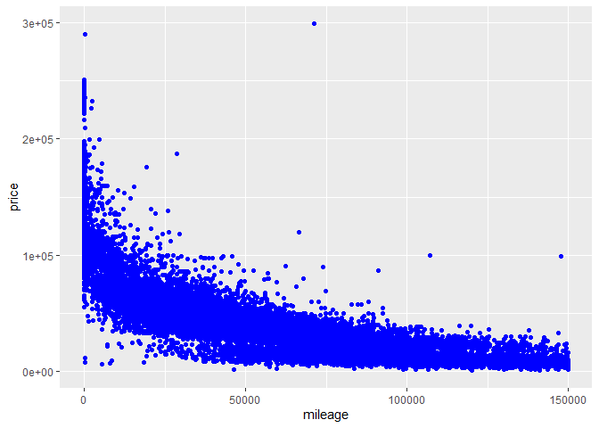

    #create graphicl rep of the distr for class363 
    g2<-ggplot(data=sclass63)+geom_point(mapping=aes(x=mileage,y=price), color="#24a0ed")+xlim(0,150000)
    g2

    ## Warning: Removed 766 rows containing missing values (geom_point).

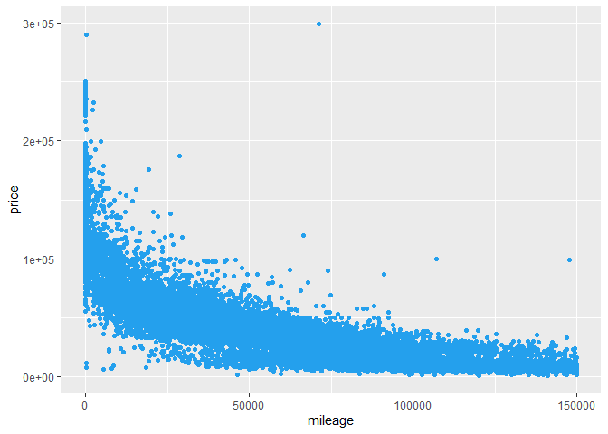

    sclass350_split=initial_split(sclass350, prop=0.8)
    sclass350_train=training(sclass350_split)
    sclass350_test=testing(sclass350_split)

    sclass63_split=initial_split(sclass63, prop=0.8)
    sclass63_train=training(sclass63_split)
    sclass63_test=testing(sclass63_split)

    #for K means clustering data needs to be scaled
    sclass350_train <- scale(sclass350_train)

    #Professor's method
    #KNN witk K=2 throyu 100 
    knn2=knnreg(mileage ~ price, data=sclass350_split,k=2)

    ## Warning: `optional` is kept for consistency with the underlying class but TRUE
    ## values will be ignored.

    ## Warning: `optional` is kept for consistency with the underlying class but TRUE
    ## values will be ignored.

    rmse2=rmse(knn2,sclass350_test)

    #k=4
    knn4=knnreg(mileage ~ price, data=sclass350_split,k=4)

    ## Warning: `optional` is kept for consistency with the underlying class but TRUE
    ## values will be ignored.

    ## Warning: `optional` is kept for consistency with the underlying class but TRUE
    ## values will be ignored.

    rmse4=rmse(knn4,sclass350_test)

    #k=10
    knn10=knnreg(mileage ~ price, data=sclass350_split,k=10)

    ## Warning: `optional` is kept for consistency with the underlying class but TRUE
    ## values will be ignored.

    ## Warning: `optional` is kept for consistency with the underlying class but TRUE
    ## values will be ignored.

    rmse10=rmse(knn10,sclass350_test)

    #KNN witk k =25
    knn25 = knnreg(mileage ~ price, data=sclass350_train, k=25)
    rmse25=rmse(knn25,sclass350_test)

    #k=50
    knn50=knnreg(mileage ~ price, data=sclass350_split,k=50)

    ## Warning: `optional` is kept for consistency with the underlying class but TRUE
    ## values will be ignored.

    ## Warning: `optional` is kept for consistency with the underlying class but TRUE
    ## values will be ignored.

    rmse50=rmse(knn50,sclass350_test)

    #k=100
    knn100=knnreg(mileage ~ price, data=sclass350_split,k=100)

    ## Warning: `optional` is kept for consistency with the underlying class but TRUE
    ## values will be ignored.

    ## Warning: `optional` is kept for consistency with the underlying class but TRUE
    ## values will be ignored.

    rmse100=rmse(knn100,sclass350_test)

    #We can use Elbow method to determin optimal K value.
    #The Elbow method considers the total within-cluster sum of square (total WSS) 
    #as a function of the number of clusters, but sometimes it does not give clear results
    # we are looking for a sharp decline from one k 
    #to another followed by a more gradual decrease in slope

    #elbow method
    library(recommenderlab)

    ## Loading required package: arules

    ## 
    ## Attaching package: 'arules'

    ## The following object is masked from 'package:dplyr':
    ## 
    ##     recode

    ## The following objects are masked from 'package:base':
    ## 
    ##     abbreviate, write

    ## Loading required package: proxy

    ## 
    ## Attaching package: 'proxy'

    ## The following object is masked from 'package:Matrix':
    ## 
    ##     as.matrix

    ## The following objects are masked from 'package:stats':
    ## 
    ##     as.dist, dist

    ## The following object is masked from 'package:base':
    ## 
    ##     as.matrix

    ## Loading required package: registry

    ## Registered S3 methods overwritten by 'registry':
    ##   method               from 
    ##   print.registry_field proxy
    ##   print.registry_entry proxy

    ## 
    ## Attaching package: 'recommenderlab'

    ## The following objects are masked from 'package:igraph':
    ## 
    ##     normalize, similarity

    ## The following object is masked from 'package:lme4':
    ## 
    ##     getData

    ## The following objects are masked from 'package:caret':
    ## 
    ##     MAE, RMSE

    value_k=c()
    value_metric=c()

    data=sclass350_train
    for (i in 2:20){
      km = kmeans(sclass350_train, i)
      value_k=c(value_k,i)
      metric = km$tot.withinss/km$totss
      value_metric=c(value_metric, metric)
    }

    ## Warning: Quick-TRANSfer stage steps exceeded maximum (= 1178650)

    ## Warning: Quick-TRANSfer stage steps exceeded maximum (= 1178650)

    ## Warning: Quick-TRANSfer stage steps exceeded maximum (= 1178650)

    ## Warning: Quick-TRANSfer stage steps exceeded maximum (= 1178650)

    #visualize elbow method
    data <- as.data.frame(cbind(value_k, value_metric))
    g3<-ggplot(data, aes(x = value_k, y = value_metric)) +
      geom_line(color="#24a0ed", size = 1) + geom_point()+
      scale_x_continuous(breaks = 1:20) + theme_minimal()
    g3

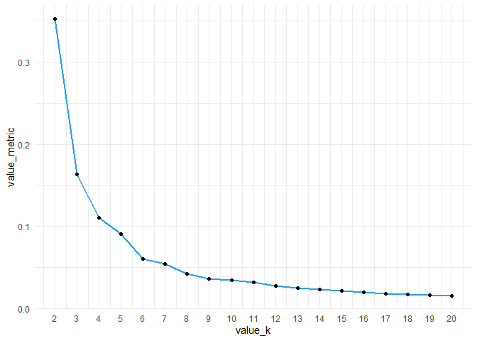

    #KNN witk K=2 throyu 100 
    seg.k <- kmeans(sclass350_train, centers=2)
    p1<-plotcluster(sclass350_train, seg.k$cluster)

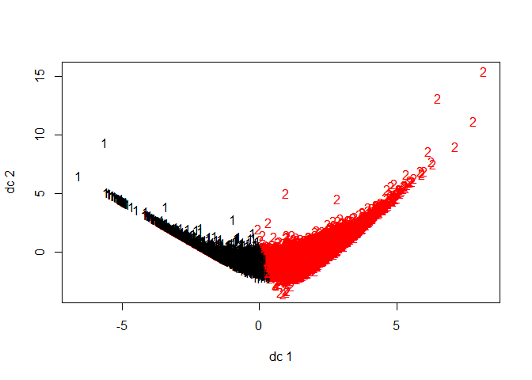

    p1

    ## NULL

    #putting RMSE vs K
    k<-c(2,4,10,25,50,100)
    rmse<-c(rmse2,rmse4,rmse10,rmse25,rmse50,rmse100)
    errors<-data.frame(k,rmse)
    errors

    ggplot(data=errors)+geom_line(aes(k,rmse))

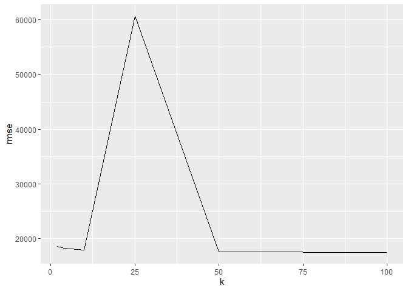
\* It looks like the optimal value of K = 25\*
