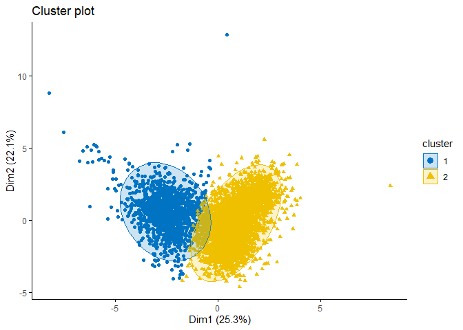
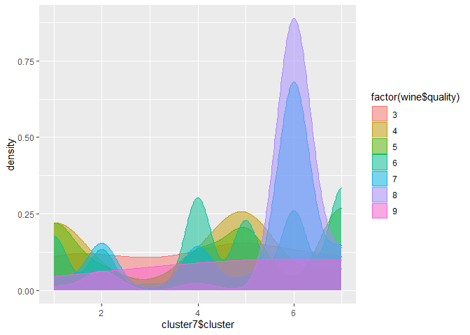

DM\_HW\_4
================
Anuka Revi
4/19/2021

# **Clustering and PCA**

## **Part A - Predict Wine Color**

This data wine.csv contains information on 11 chemical properties of
6500 different bottles of *vinho verde* from northern Portugal. In this
mini project I present a PCA and K-means clustering model that is
capable of distinguishing the red wine from the white one, using only
the “unsupervised” information contained in the data on chemical
properties. Additionally, we will try to assess whether these models are
capable of distinguishing higher form the lower quality of wine.

Fig1 below shows a histogram of wine quality across red and white wines.
Both colors have approximately normal distribution with higher number of
decent quality wines (quality index between 5 and 7) but there are about
three times as many white wines in the data as red ones.

<table>

<thead>

<tr>

<th style="text-align:right;">

fixed.acidity

</th>

<th style="text-align:right;">

volatile.acidity

</th>

<th style="text-align:right;">

citric.acid

</th>

<th style="text-align:right;">

residual.sugar

</th>

<th style="text-align:right;">

chlorides

</th>

<th style="text-align:right;">

free.sulfur.dioxide

</th>

<th style="text-align:right;">

total.sulfur.dioxide

</th>

<th style="text-align:right;">

density

</th>

<th style="text-align:right;">

pH

</th>

<th style="text-align:right;">

sulphates

</th>

<th style="text-align:right;">

alcohol

</th>

<th style="text-align:right;">

quality

</th>

<th style="text-align:left;">

color

</th>

</tr>

</thead>

<tbody>

<tr>

<td style="text-align:right;">

7.4

</td>

<td style="text-align:right;">

0.70

</td>

<td style="text-align:right;">

0.00

</td>

<td style="text-align:right;">

1.9

</td>

<td style="text-align:right;">

0.076

</td>

<td style="text-align:right;">

11

</td>

<td style="text-align:right;">

34

</td>

<td style="text-align:right;">

0.9978

</td>

<td style="text-align:right;">

3.51

</td>

<td style="text-align:right;">

0.56

</td>

<td style="text-align:right;">

9.4

</td>

<td style="text-align:right;">

5

</td>

<td style="text-align:left;">

red

</td>

</tr>

<tr>

<td style="text-align:right;">

7.8

</td>

<td style="text-align:right;">

0.88

</td>

<td style="text-align:right;">

0.00

</td>

<td style="text-align:right;">

2.6

</td>

<td style="text-align:right;">

0.098

</td>

<td style="text-align:right;">

25

</td>

<td style="text-align:right;">

67

</td>

<td style="text-align:right;">

0.9968

</td>

<td style="text-align:right;">

3.20

</td>

<td style="text-align:right;">

0.68

</td>

<td style="text-align:right;">

9.8

</td>

<td style="text-align:right;">

5

</td>

<td style="text-align:left;">

red

</td>

</tr>

<tr>

<td style="text-align:right;">

7.8

</td>

<td style="text-align:right;">

0.76

</td>

<td style="text-align:right;">

0.04

</td>

<td style="text-align:right;">

2.3

</td>

<td style="text-align:right;">

0.092

</td>

<td style="text-align:right;">

15

</td>

<td style="text-align:right;">

54

</td>

<td style="text-align:right;">

0.9970

</td>

<td style="text-align:right;">

3.26

</td>

<td style="text-align:right;">

0.65

</td>

<td style="text-align:right;">

9.8

</td>

<td style="text-align:right;">

5

</td>

<td style="text-align:left;">

red

</td>

</tr>

<tr>

<td style="text-align:right;">

11.2

</td>

<td style="text-align:right;">

0.28

</td>

<td style="text-align:right;">

0.56

</td>

<td style="text-align:right;">

1.9

</td>

<td style="text-align:right;">

0.075

</td>

<td style="text-align:right;">

17

</td>

<td style="text-align:right;">

60

</td>

<td style="text-align:right;">

0.9980

</td>

<td style="text-align:right;">

3.16

</td>

<td style="text-align:right;">

0.58

</td>

<td style="text-align:right;">

9.8

</td>

<td style="text-align:right;">

6

</td>

<td style="text-align:left;">

red

</td>

</tr>

<tr>

<td style="text-align:right;">

7.4

</td>

<td style="text-align:right;">

0.70

</td>

<td style="text-align:right;">

0.00

</td>

<td style="text-align:right;">

1.9

</td>

<td style="text-align:right;">

0.076

</td>

<td style="text-align:right;">

11

</td>

<td style="text-align:right;">

34

</td>

<td style="text-align:right;">

0.9978

</td>

<td style="text-align:right;">

3.51

</td>

<td style="text-align:right;">

0.56

</td>

<td style="text-align:right;">

9.4

</td>

<td style="text-align:right;">

5

</td>

<td style="text-align:left;">

red

</td>

</tr>

<tr>

<td style="text-align:right;">

7.4

</td>

<td style="text-align:right;">

0.66

</td>

<td style="text-align:right;">

0.00

</td>

<td style="text-align:right;">

1.8

</td>

<td style="text-align:right;">

0.075

</td>

<td style="text-align:right;">

13

</td>

<td style="text-align:right;">

40

</td>

<td style="text-align:right;">

0.9978

</td>

<td style="text-align:right;">

3.51

</td>

<td style="text-align:right;">

0.56

</td>

<td style="text-align:right;">

9.4

</td>

<td style="text-align:right;">

5

</td>

<td style="text-align:left;">

red

</td>

</tr>

</tbody>

</table>


Figure 2 displays boxplot for wine attributes and Correlation Matrix of
these attributes. Boxplot is a useful tool to visualize distribution of
each characteristic(variable) in the wine data set. From the correlation
matrix we see a perfect negative linear relationship between alcohol and
density as well as strong positive relationship between free sulfur
dioxide and total sulfur dioxide as well as density and residual sugar.
Clustering will allow us to see if wines with characteristics that are
similar or correlated to one another end up in the same group.


When we do clustering and PCA we need to normalize values in order to
avoid measurements of different size to distort our analysis. We want
mean of 0 and standard deviation of 1. To evaluate the optimal K for
clustering in general it is useful to use the elbow plot shown below.
*We should choose a number of clusters so that adding another cluster
does not give much better partition of the data*. In this case elbow
plot shows that K=3 could work, but since we know that we want to
determine wine color either red or white , **I am using K=2 clusters**
(It is important to remember that we are using normalized data and color
variable of interest is not included)


plot below visualizes clustering with K=2 and table provides the number
of red and white wines in each cluster. Clustering with ggpair graphs
gives us cluster of 2 different color wines within different
characteristics.



    ##                wine$color
    ## wine_k2$cluster  red white
    ##               1 1574    94
    ##               2   25  4804


\*\*PCA for wine color analysis\*\*

Principal component analysis (PCA) reduces the dimensionality of
multivariate data, to two or three that can be visualized graphically
with minimal loss of information. Clustering using PCA analysis gives us
similar results. Also on wine variance - PCA graphs we see that with PCA
we can explain over 60% of the variance with just 3 principal
components.

<!-- --><!-- -->

## **Part B - Wine Quality Prediction**

In this section we are trying to predict quality of wine. Fig1 - quality
and color of wines show that most wines are of quality 6 and very few
wines are of quality 8 and above in our dataset. Thus I chose K=7
clusters.

<!-- --><!-- --><!-- -->

    ##                 wine$quality
    ## cluster7$cluster   3   4   5   6   7   8   9
    ##                1   6  75 517 343  40   2   0
    ##                2   3   9 153 261 138  11   0
    ##                3   3   2  52  43   2   0   0
    ##                4   2  23 283 589 129   4   0
    ##                5   9  83 469 444  34   0   0
    ##                6   0   0  16 506 611 155   5
    ##                7   7  24 648 650 125  21   0

Above graphs show that applying the same methodology as we did in part
A, predicting wine quality based on clusters are more difficult than
predicting wine color. Some clusters are well defined , such as cluster
7, while others are hard to identify, for instance cluster 3.

# **Market Segmentation**

The goal of this project is for NutrientH20 which is a hypothetical
consumer drink brand to understand its social-media audience a little
bit better to maximize appeal to each of their market segment. The
sample was taken from the brand’s Twitter followers (every tweet by its
followers collected over 7 days period in June 2014 and was categorized
based on its content using a pre-specified scheme of 36 different
categories, each representing a broad area of interest (e.g. politics,
sports, family, etc. I will use K-Means clustering to analyze this data.

### **Data Exploration**

<table>

<thead>

<tr>

<th style="text-align:left;">

X

</th>

<th style="text-align:right;">

chatter

</th>

<th style="text-align:right;">

current\_events

</th>

<th style="text-align:right;">

travel

</th>

<th style="text-align:right;">

photo\_sharing

</th>

<th style="text-align:right;">

uncategorized

</th>

<th style="text-align:right;">

tv\_film

</th>

<th style="text-align:right;">

sports\_fandom

</th>

<th style="text-align:right;">

politics

</th>

<th style="text-align:right;">

food

</th>

<th style="text-align:right;">

family

</th>

<th style="text-align:right;">

home\_and\_garden

</th>

<th style="text-align:right;">

music

</th>

<th style="text-align:right;">

news

</th>

<th style="text-align:right;">

online\_gaming

</th>

<th style="text-align:right;">

shopping

</th>

<th style="text-align:right;">

health\_nutrition

</th>

<th style="text-align:right;">

college\_uni

</th>

<th style="text-align:right;">

sports\_playing

</th>

<th style="text-align:right;">

cooking

</th>

<th style="text-align:right;">

eco

</th>

<th style="text-align:right;">

computers

</th>

<th style="text-align:right;">

business

</th>

<th style="text-align:right;">

outdoors

</th>

<th style="text-align:right;">

crafts

</th>

<th style="text-align:right;">

automotive

</th>

<th style="text-align:right;">

art

</th>

<th style="text-align:right;">

religion

</th>

<th style="text-align:right;">

beauty

</th>

<th style="text-align:right;">

parenting

</th>

<th style="text-align:right;">

dating

</th>

<th style="text-align:right;">

school

</th>

<th style="text-align:right;">

personal\_fitness

</th>

<th style="text-align:right;">

fashion

</th>

<th style="text-align:right;">

small\_business

</th>

<th style="text-align:right;">

spam

</th>

<th style="text-align:right;">

adult

</th>

</tr>

</thead>

<tbody>

<tr>

<td style="text-align:left;">

hmjoe4g3k

</td>

<td style="text-align:right;">

2

</td>

<td style="text-align:right;">

0

</td>

<td style="text-align:right;">

2

</td>

<td style="text-align:right;">

2

</td>

<td style="text-align:right;">

2

</td>

<td style="text-align:right;">

1

</td>

<td style="text-align:right;">

1

</td>

<td style="text-align:right;">

0

</td>

<td style="text-align:right;">

4

</td>

<td style="text-align:right;">

1

</td>

<td style="text-align:right;">

2

</td>

<td style="text-align:right;">

0

</td>

<td style="text-align:right;">

0

</td>

<td style="text-align:right;">

0

</td>

<td style="text-align:right;">

1

</td>

<td style="text-align:right;">

17

</td>

<td style="text-align:right;">

0

</td>

<td style="text-align:right;">

2

</td>

<td style="text-align:right;">

5

</td>

<td style="text-align:right;">

1

</td>

<td style="text-align:right;">

1

</td>

<td style="text-align:right;">

0

</td>

<td style="text-align:right;">

2

</td>

<td style="text-align:right;">

1

</td>

<td style="text-align:right;">

0

</td>

<td style="text-align:right;">

0

</td>

<td style="text-align:right;">

1

</td>

<td style="text-align:right;">

0

</td>

<td style="text-align:right;">

1

</td>

<td style="text-align:right;">

1

</td>

<td style="text-align:right;">

0

</td>

<td style="text-align:right;">

11

</td>

<td style="text-align:right;">

0

</td>

<td style="text-align:right;">

0

</td>

<td style="text-align:right;">

0

</td>

<td style="text-align:right;">

0

</td>

</tr>

<tr>

<td style="text-align:left;">

clk1m5w8s

</td>

<td style="text-align:right;">

3

</td>

<td style="text-align:right;">

3

</td>

<td style="text-align:right;">

2

</td>

<td style="text-align:right;">

1

</td>

<td style="text-align:right;">

1

</td>

<td style="text-align:right;">

1

</td>

<td style="text-align:right;">

4

</td>

<td style="text-align:right;">

1

</td>

<td style="text-align:right;">

2

</td>

<td style="text-align:right;">

2

</td>

<td style="text-align:right;">

1

</td>

<td style="text-align:right;">

0

</td>

<td style="text-align:right;">

0

</td>

<td style="text-align:right;">

0

</td>

<td style="text-align:right;">

0

</td>

<td style="text-align:right;">

0

</td>

<td style="text-align:right;">

0

</td>

<td style="text-align:right;">

1

</td>

<td style="text-align:right;">

0

</td>

<td style="text-align:right;">

0

</td>

<td style="text-align:right;">

0

</td>

<td style="text-align:right;">

1

</td>

<td style="text-align:right;">

0

</td>

<td style="text-align:right;">

2

</td>

<td style="text-align:right;">

0

</td>

<td style="text-align:right;">

0

</td>

<td style="text-align:right;">

0

</td>

<td style="text-align:right;">

0

</td>

<td style="text-align:right;">

0

</td>

<td style="text-align:right;">

1

</td>

<td style="text-align:right;">

4

</td>

<td style="text-align:right;">

0

</td>

<td style="text-align:right;">

0

</td>

<td style="text-align:right;">

0

</td>

<td style="text-align:right;">

0

</td>

<td style="text-align:right;">

0

</td>

</tr>

<tr>

<td style="text-align:left;">

jcsovtak3

</td>

<td style="text-align:right;">

6

</td>

<td style="text-align:right;">

3

</td>

<td style="text-align:right;">

4

</td>

<td style="text-align:right;">

3

</td>

<td style="text-align:right;">

1

</td>

<td style="text-align:right;">

5

</td>

<td style="text-align:right;">

0

</td>

<td style="text-align:right;">

2

</td>

<td style="text-align:right;">

1

</td>

<td style="text-align:right;">

1

</td>

<td style="text-align:right;">

1

</td>

<td style="text-align:right;">

1

</td>

<td style="text-align:right;">

1

</td>

<td style="text-align:right;">

0

</td>

<td style="text-align:right;">

2

</td>

<td style="text-align:right;">

0

</td>

<td style="text-align:right;">

0

</td>

<td style="text-align:right;">

0

</td>

<td style="text-align:right;">

2

</td>

<td style="text-align:right;">

1

</td>

<td style="text-align:right;">

0

</td>

<td style="text-align:right;">

0

</td>

<td style="text-align:right;">

0

</td>

<td style="text-align:right;">

2

</td>

<td style="text-align:right;">

0

</td>

<td style="text-align:right;">

8

</td>

<td style="text-align:right;">

0

</td>

<td style="text-align:right;">

1

</td>

<td style="text-align:right;">

0

</td>

<td style="text-align:right;">

1

</td>

<td style="text-align:right;">

0

</td>

<td style="text-align:right;">

0

</td>

<td style="text-align:right;">

1

</td>

<td style="text-align:right;">

0

</td>

<td style="text-align:right;">

0

</td>

<td style="text-align:right;">

0

</td>

</tr>

<tr>

<td style="text-align:left;">

3oeb4hiln

</td>

<td style="text-align:right;">

1

</td>

<td style="text-align:right;">

5

</td>

<td style="text-align:right;">

2

</td>

<td style="text-align:right;">

2

</td>

<td style="text-align:right;">

0

</td>

<td style="text-align:right;">

1

</td>

<td style="text-align:right;">

0

</td>

<td style="text-align:right;">

1

</td>

<td style="text-align:right;">

0

</td>

<td style="text-align:right;">

1

</td>

<td style="text-align:right;">

0

</td>

<td style="text-align:right;">

0

</td>

<td style="text-align:right;">

0

</td>

<td style="text-align:right;">

0

</td>

<td style="text-align:right;">

0

</td>

<td style="text-align:right;">

0

</td>

<td style="text-align:right;">

1

</td>

<td style="text-align:right;">

0

</td>

<td style="text-align:right;">

0

</td>

<td style="text-align:right;">

0

</td>

<td style="text-align:right;">

0

</td>

<td style="text-align:right;">

1

</td>

<td style="text-align:right;">

0

</td>

<td style="text-align:right;">

3

</td>

<td style="text-align:right;">

0

</td>

<td style="text-align:right;">

2

</td>

<td style="text-align:right;">

0

</td>

<td style="text-align:right;">

1

</td>

<td style="text-align:right;">

0

</td>

<td style="text-align:right;">

0

</td>

<td style="text-align:right;">

0

</td>

<td style="text-align:right;">

0

</td>

<td style="text-align:right;">

0

</td>

<td style="text-align:right;">

0

</td>

<td style="text-align:right;">

0

</td>

<td style="text-align:right;">

0

</td>

</tr>

<tr>

<td style="text-align:left;">

fd75x1vgk

</td>

<td style="text-align:right;">

5

</td>

<td style="text-align:right;">

2

</td>

<td style="text-align:right;">

0

</td>

<td style="text-align:right;">

6

</td>

<td style="text-align:right;">

1

</td>

<td style="text-align:right;">

0

</td>

<td style="text-align:right;">

0

</td>

<td style="text-align:right;">

2

</td>

<td style="text-align:right;">

0

</td>

<td style="text-align:right;">

1

</td>

<td style="text-align:right;">

0

</td>

<td style="text-align:right;">

0

</td>

<td style="text-align:right;">

0

</td>

<td style="text-align:right;">

3

</td>

<td style="text-align:right;">

2

</td>

<td style="text-align:right;">

0

</td>

<td style="text-align:right;">

4

</td>

<td style="text-align:right;">

0

</td>

<td style="text-align:right;">

1

</td>

<td style="text-align:right;">

0

</td>

<td style="text-align:right;">

1

</td>

<td style="text-align:right;">

0

</td>

<td style="text-align:right;">

1

</td>

<td style="text-align:right;">

0

</td>

<td style="text-align:right;">

0

</td>

<td style="text-align:right;">

0

</td>

<td style="text-align:right;">

0

</td>

<td style="text-align:right;">

0

</td>

<td style="text-align:right;">

0

</td>

<td style="text-align:right;">

0

</td>

<td style="text-align:right;">

0

</td>

<td style="text-align:right;">

0

</td>

<td style="text-align:right;">

0

</td>

<td style="text-align:right;">

1

</td>

<td style="text-align:right;">

0

</td>

<td style="text-align:right;">

0

</td>

</tr>

<tr>

<td style="text-align:left;">

h6nvj91yp

</td>

<td style="text-align:right;">

6

</td>

<td style="text-align:right;">

4

</td>

<td style="text-align:right;">

2

</td>

<td style="text-align:right;">

7

</td>

<td style="text-align:right;">

0

</td>

<td style="text-align:right;">

1

</td>

<td style="text-align:right;">

1

</td>

<td style="text-align:right;">

0

</td>

<td style="text-align:right;">

2

</td>

<td style="text-align:right;">

1

</td>

<td style="text-align:right;">

1

</td>

<td style="text-align:right;">

1

</td>

<td style="text-align:right;">

0

</td>

<td style="text-align:right;">

0

</td>

<td style="text-align:right;">

5

</td>

<td style="text-align:right;">

0

</td>

<td style="text-align:right;">

0

</td>

<td style="text-align:right;">

0

</td>

<td style="text-align:right;">

0

</td>

<td style="text-align:right;">

0

</td>

<td style="text-align:right;">

1

</td>

<td style="text-align:right;">

1

</td>

<td style="text-align:right;">

0

</td>

<td style="text-align:right;">

0

</td>

<td style="text-align:right;">

1

</td>

<td style="text-align:right;">

0

</td>

<td style="text-align:right;">

0

</td>

<td style="text-align:right;">

0

</td>

<td style="text-align:right;">

0

</td>

<td style="text-align:right;">

0

</td>

<td style="text-align:right;">

0

</td>

<td style="text-align:right;">

0

</td>

<td style="text-align:right;">

0

</td>

<td style="text-align:right;">

0

</td>

<td style="text-align:right;">

0

</td>

<td style="text-align:right;">

0

</td>

</tr>

</tbody>

</table>


\\

thing we are looking at the correlation matrix and we see that some
variables are strongly correlated. some of the most correlated variables
are: -\> online\_gaming and college\_uni -\> health nutrition & personal
fitness -\> cooking with fashion and beauty -\> religion with parenting
With that in mind we should do clustering and learn whether these
variables end up in the same cluster.

### **K-Means Clustering**

K-means clustering requires normalization of the data. I show elbow
method to analyze what K-value is the most optimal for our data but it
is not very helpful. According to the elbow plot we would go with 2
clusters but with given number of different market segments that would
not be enough. So I arbitrarily chose K=6.


<!-- -->

In order to identify which cluster belongs to which type of market
segment(customer profiles) we need to apply these clusters to the mean
number of tweets in the original marketing data.

<table>

<thead>

<tr>

<th style="text-align:right;">

cluster

</th>

<th style="text-align:right;">

current\_events

</th>

<th style="text-align:right;">

travel

</th>

<th style="text-align:right;">

photo\_sharing

</th>

<th style="text-align:right;">

uncategorized

</th>

<th style="text-align:right;">

tv\_film

</th>

<th style="text-align:right;">

sports\_fandom

</th>

<th style="text-align:right;">

politics

</th>

<th style="text-align:right;">

food

</th>

<th style="text-align:right;">

family

</th>

<th style="text-align:right;">

home\_and\_garden

</th>

<th style="text-align:right;">

music

</th>

<th style="text-align:right;">

news

</th>

<th style="text-align:right;">

online\_gaming

</th>

<th style="text-align:right;">

shopping

</th>

<th style="text-align:right;">

health\_nutrition

</th>

<th style="text-align:right;">

college\_uni

</th>

<th style="text-align:right;">

sports\_playing

</th>

<th style="text-align:right;">

cooking

</th>

<th style="text-align:right;">

eco

</th>

<th style="text-align:right;">

computers

</th>

<th style="text-align:right;">

business

</th>

<th style="text-align:right;">

outdoors

</th>

<th style="text-align:right;">

crafts

</th>

<th style="text-align:right;">

automotive

</th>

<th style="text-align:right;">

art

</th>

<th style="text-align:right;">

religion

</th>

<th style="text-align:right;">

beauty

</th>

<th style="text-align:right;">

parenting

</th>

<th style="text-align:right;">

dating

</th>

<th style="text-align:right;">

school

</th>

<th style="text-align:right;">

personal\_fitness

</th>

<th style="text-align:right;">

fashion

</th>

<th style="text-align:right;">

small\_business

</th>

<th style="text-align:right;">

spam

</th>

<th style="text-align:right;">

adult

</th>

</tr>

</thead>

<tbody>

<tr>

<td style="text-align:right;">

1

</td>

<td style="text-align:right;">

1.667155

</td>

<td style="text-align:right;">

5.612903

</td>

<td style="text-align:right;">

2.541056

</td>

<td style="text-align:right;">

0.7756598

</td>

<td style="text-align:right;">

1.1994135

</td>

<td style="text-align:right;">

2.0146628

</td>

<td style="text-align:right;">

8.960411

</td>

<td style="text-align:right;">

1.4413490

</td>

<td style="text-align:right;">

0.9134897

</td>

<td style="text-align:right;">

0.6114370

</td>

<td style="text-align:right;">

0.6407625

</td>

<td style="text-align:right;">

5.3181818

</td>

<td style="text-align:right;">

0.8284457

</td>

<td style="text-align:right;">

1.379765

</td>

<td style="text-align:right;">

1.639296

</td>

<td style="text-align:right;">

1.3181818

</td>

<td style="text-align:right;">

0.6290323

</td>

<td style="text-align:right;">

1.2595308

</td>

<td style="text-align:right;">

0.5938416

</td>

<td style="text-align:right;">

2.4736070

</td>

<td style="text-align:right;">

0.6700880

</td>

<td style="text-align:right;">

0.9164223

</td>

<td style="text-align:right;">

0.6407625

</td>

<td style="text-align:right;">

2.3475073

</td>

<td style="text-align:right;">

0.7184751

</td>

<td style="text-align:right;">

1.0307918

</td>

<td style="text-align:right;">

0.4736070

</td>

<td style="text-align:right;">

0.9472141

</td>

<td style="text-align:right;">

1.0689150

</td>

<td style="text-align:right;">

0.7258065

</td>

<td style="text-align:right;">

1.0000000

</td>

<td style="text-align:right;">

0.6686217

</td>

<td style="text-align:right;">

0.4838710

</td>

<td style="text-align:right;">

0.0058651

</td>

<td style="text-align:right;">

0.2360704

</td>

</tr>

<tr>

<td style="text-align:right;">

2

</td>

<td style="text-align:right;">

1.513513

</td>

<td style="text-align:right;">

1.576577

</td>

<td style="text-align:right;">

2.867117

</td>

<td style="text-align:right;">

0.9346847

</td>

<td style="text-align:right;">

1.8626126

</td>

<td style="text-align:right;">

1.3378378

</td>

<td style="text-align:right;">

1.286036

</td>

<td style="text-align:right;">

1.2635135

</td>

<td style="text-align:right;">

1.0720721

</td>

<td style="text-align:right;">

0.6148649

</td>

<td style="text-align:right;">

1.0585586

</td>

<td style="text-align:right;">

0.7995495

</td>

<td style="text-align:right;">

9.4009009

</td>

<td style="text-align:right;">

1.398649

</td>

<td style="text-align:right;">

1.738739

</td>

<td style="text-align:right;">

10.4301802

</td>

<td style="text-align:right;">

2.5788288

</td>

<td style="text-align:right;">

1.4549550

</td>

<td style="text-align:right;">

0.4932432

</td>

<td style="text-align:right;">

0.5833333

</td>

<td style="text-align:right;">

0.4504505

</td>

<td style="text-align:right;">

0.6599099

</td>

<td style="text-align:right;">

0.6013514

</td>

<td style="text-align:right;">

0.8873874

</td>

<td style="text-align:right;">

1.2184685

</td>

<td style="text-align:right;">

0.8536036

</td>

<td style="text-align:right;">

0.4436937

</td>

<td style="text-align:right;">

0.6891892

</td>

<td style="text-align:right;">

0.7342342

</td>

<td style="text-align:right;">

0.5315315

</td>

<td style="text-align:right;">

1.0000000

</td>

<td style="text-align:right;">

0.8896396

</td>

<td style="text-align:right;">

0.4842342

</td>

<td style="text-align:right;">

0.0090090

</td>

<td style="text-align:right;">

0.4572072

</td>

</tr>

<tr>

<td style="text-align:right;">

3

</td>

<td style="text-align:right;">

1.558923

</td>

<td style="text-align:right;">

1.242424

</td>

<td style="text-align:right;">

2.658810

</td>

<td style="text-align:right;">

0.9674523

</td>

<td style="text-align:right;">

0.9876543

</td>

<td style="text-align:right;">

1.1649832

</td>

<td style="text-align:right;">

1.255892

</td>

<td style="text-align:right;">

2.1279461

</td>

<td style="text-align:right;">

0.7732884

</td>

<td style="text-align:right;">

0.6363636

</td>

<td style="text-align:right;">

0.7418631

</td>

<td style="text-align:right;">

1.1054994

</td>

<td style="text-align:right;">

0.8462402

</td>

<td style="text-align:right;">

1.457912

</td>

<td style="text-align:right;">

12.001122

</td>

<td style="text-align:right;">

0.9494949

</td>

<td style="text-align:right;">

0.6071829

</td>

<td style="text-align:right;">

3.2760943

</td>

<td style="text-align:right;">

0.9203143

</td>

<td style="text-align:right;">

0.5611672

</td>

<td style="text-align:right;">

0.4702581

</td>

<td style="text-align:right;">

2.7362514

</td>

<td style="text-align:right;">

0.5892256

</td>

<td style="text-align:right;">

0.6632997

</td>

<td style="text-align:right;">

0.7384961

</td>

<td style="text-align:right;">

0.7631874

</td>

<td style="text-align:right;">

0.4253648

</td>

<td style="text-align:right;">

0.7586981

</td>

<td style="text-align:right;">

1.0347924

</td>

<td style="text-align:right;">

0.5993266

</td>

<td style="text-align:right;">

6.4377104

</td>

<td style="text-align:right;">

0.7991021

</td>

<td style="text-align:right;">

0.2929293

</td>

<td style="text-align:right;">

0.0067340

</td>

<td style="text-align:right;">

0.4231201

</td>

</tr>

<tr>

<td style="text-align:right;">

4

</td>

<td style="text-align:right;">

1.442974

</td>

<td style="text-align:right;">

1.098390

</td>

<td style="text-align:right;">

2.292742

</td>

<td style="text-align:right;">

0.7273329

</td>

<td style="text-align:right;">

0.9907346

</td>

<td style="text-align:right;">

0.9711008

</td>

<td style="text-align:right;">

1.010810

</td>

<td style="text-align:right;">

0.7683653

</td>

<td style="text-align:right;">

0.5737922

</td>

<td style="text-align:right;">

0.4396647

</td>

<td style="text-align:right;">

0.5537172

</td>

<td style="text-align:right;">

0.6926980

</td>

<td style="text-align:right;">

0.5868079

</td>

<td style="text-align:right;">

1.276859

</td>

<td style="text-align:right;">

1.090007

</td>

<td style="text-align:right;">

0.8945511

</td>

<td style="text-align:right;">

0.4180454

</td>

<td style="text-align:right;">

0.8625634

</td>

<td style="text-align:right;">

0.3880432

</td>

<td style="text-align:right;">

0.3743658

</td>

<td style="text-align:right;">

0.3357600

</td>

<td style="text-align:right;">

0.4015001

</td>

<td style="text-align:right;">

0.3628943

</td>

<td style="text-align:right;">

0.5812927

</td>

<td style="text-align:right;">

0.6232076

</td>

<td style="text-align:right;">

0.5239356

</td>

<td style="text-align:right;">

0.3534083

</td>

<td style="text-align:right;">

0.4595191

</td>

<td style="text-align:right;">

0.5437900

</td>

<td style="text-align:right;">

0.4760644

</td>

<td style="text-align:right;">

0.6585043

</td>

<td style="text-align:right;">

0.5144496

</td>

<td style="text-align:right;">

0.2764174

</td>

<td style="text-align:right;">

0.0068387

</td>

<td style="text-align:right;">

0.4160600

</td>

</tr>

<tr>

<td style="text-align:right;">

5

</td>

<td style="text-align:right;">

1.778360

</td>

<td style="text-align:right;">

1.497382

</td>

<td style="text-align:right;">

6.109948

</td>

<td style="text-align:right;">

1.2897033

</td>

<td style="text-align:right;">

1.0785340

</td>

<td style="text-align:right;">

1.1745201

</td>

<td style="text-align:right;">

1.441536

</td>

<td style="text-align:right;">

1.0820244

</td>

<td style="text-align:right;">

0.9162304

</td>

<td style="text-align:right;">

0.6369983

</td>

<td style="text-align:right;">

1.2530541

</td>

<td style="text-align:right;">

1.0593368

</td>

<td style="text-align:right;">

1.0663176

</td>

<td style="text-align:right;">

2.068063

</td>

<td style="text-align:right;">

2.282723

</td>

<td style="text-align:right;">

1.5287958

</td>

<td style="text-align:right;">

0.8167539

</td>

<td style="text-align:right;">

10.8307155

</td>

<td style="text-align:right;">

0.5794066

</td>

<td style="text-align:right;">

0.7312391

</td>

<td style="text-align:right;">

0.6212914

</td>

<td style="text-align:right;">

0.8254799

</td>

<td style="text-align:right;">

0.6387435

</td>

<td style="text-align:right;">

0.9057592

</td>

<td style="text-align:right;">

0.9493892

</td>

<td style="text-align:right;">

0.8691099

</td>

<td style="text-align:right;">

3.8830716

</td>

<td style="text-align:right;">

0.8237347

</td>

<td style="text-align:right;">

0.9930192

</td>

<td style="text-align:right;">

1.0017452

</td>

<td style="text-align:right;">

1.3542757

</td>

<td style="text-align:right;">

5.5741710

</td>

<td style="text-align:right;">

0.5026178

</td>

<td style="text-align:right;">

0.0034904

</td>

<td style="text-align:right;">

0.4380454

</td>

</tr>

<tr>

<td style="text-align:right;">

6

</td>

<td style="text-align:right;">

1.675889

</td>

<td style="text-align:right;">

1.345191

</td>

<td style="text-align:right;">

2.617918

</td>

<td style="text-align:right;">

0.7457181

</td>

<td style="text-align:right;">

1.0566535

</td>

<td style="text-align:right;">

5.9064559

</td>

<td style="text-align:right;">

1.171278

</td>

<td style="text-align:right;">

4.5744401

</td>

<td style="text-align:right;">

2.4967062

</td>

<td style="text-align:right;">

0.6442688

</td>

<td style="text-align:right;">

0.7351779

</td>

<td style="text-align:right;">

1.0382082

</td>

<td style="text-align:right;">

1.0065876

</td>

<td style="text-align:right;">

1.471673

</td>

<td style="text-align:right;">

1.848485

</td>

<td style="text-align:right;">

1.1936759

</td>

<td style="text-align:right;">

0.7378129

</td>

<td style="text-align:right;">

1.5942029

</td>

<td style="text-align:right;">

0.6627141

</td>

<td style="text-align:right;">

0.7299078

</td>

<td style="text-align:right;">

0.5032938

</td>

<td style="text-align:right;">

0.6851120

</td>

<td style="text-align:right;">

1.0882740

</td>

<td style="text-align:right;">

1.0553360

</td>

<td style="text-align:right;">

0.8629776

</td>

<td style="text-align:right;">

5.2687747

</td>

<td style="text-align:right;">

1.0961792

</td>

<td style="text-align:right;">

4.0566535

</td>

<td style="text-align:right;">

0.7799736

</td>

<td style="text-align:right;">

2.7061924

</td>

<td style="text-align:right;">

1.1870883

</td>

<td style="text-align:right;">

1.0092227

</td>

<td style="text-align:right;">

0.4005270

</td>

<td style="text-align:right;">

0.0052701

</td>

<td style="text-align:right;">

0.3965744

</td>

</tr>

</tbody>

</table>

<table>

<thead>

<tr>

<th style="text-align:left;">

V1

</th>

<th style="text-align:left;">

k

</th>

</tr>

</thead>

<tbody>

<tr>

<td style="text-align:left;">

current\_events

</td>

<td style="text-align:left;">

5

</td>

</tr>

<tr>

<td style="text-align:left;">

travel

</td>

<td style="text-align:left;">

1

</td>

</tr>

<tr>

<td style="text-align:left;">

photo\_sharing

</td>

<td style="text-align:left;">

5

</td>

</tr>

<tr>

<td style="text-align:left;">

uncategorized

</td>

<td style="text-align:left;">

5

</td>

</tr>

<tr>

<td style="text-align:left;">

tv\_film

</td>

<td style="text-align:left;">

2

</td>

</tr>

<tr>

<td style="text-align:left;">

sports\_fandom

</td>

<td style="text-align:left;">

6

</td>

</tr>

<tr>

<td style="text-align:left;">

politics

</td>

<td style="text-align:left;">

1

</td>

</tr>

<tr>

<td style="text-align:left;">

food

</td>

<td style="text-align:left;">

6

</td>

</tr>

<tr>

<td style="text-align:left;">

family

</td>

<td style="text-align:left;">

6

</td>

</tr>

<tr>

<td style="text-align:left;">

home\_and\_garden

</td>

<td style="text-align:left;">

6

</td>

</tr>

<tr>

<td style="text-align:left;">

music

</td>

<td style="text-align:left;">

5

</td>

</tr>

<tr>

<td style="text-align:left;">

news

</td>

<td style="text-align:left;">

1

</td>

</tr>

<tr>

<td style="text-align:left;">

online\_gaming

</td>

<td style="text-align:left;">

2

</td>

</tr>

<tr>

<td style="text-align:left;">

shopping

</td>

<td style="text-align:left;">

5

</td>

</tr>

<tr>

<td style="text-align:left;">

health\_nutrition

</td>

<td style="text-align:left;">

3

</td>

</tr>

<tr>

<td style="text-align:left;">

college\_uni

</td>

<td style="text-align:left;">

2

</td>

</tr>

<tr>

<td style="text-align:left;">

sports\_playing

</td>

<td style="text-align:left;">

2

</td>

</tr>

<tr>

<td style="text-align:left;">

cooking

</td>

<td style="text-align:left;">

5

</td>

</tr>

<tr>

<td style="text-align:left;">

eco

</td>

<td style="text-align:left;">

3

</td>

</tr>

<tr>

<td style="text-align:left;">

computers

</td>

<td style="text-align:left;">

1

</td>

</tr>

<tr>

<td style="text-align:left;">

business

</td>

<td style="text-align:left;">

1

</td>

</tr>

<tr>

<td style="text-align:left;">

outdoors

</td>

<td style="text-align:left;">

3

</td>

</tr>

<tr>

<td style="text-align:left;">

crafts

</td>

<td style="text-align:left;">

6

</td>

</tr>

<tr>

<td style="text-align:left;">

automotive

</td>

<td style="text-align:left;">

1

</td>

</tr>

<tr>

<td style="text-align:left;">

art

</td>

<td style="text-align:left;">

2

</td>

</tr>

<tr>

<td style="text-align:left;">

religion

</td>

<td style="text-align:left;">

6

</td>

</tr>

<tr>

<td style="text-align:left;">

beauty

</td>

<td style="text-align:left;">

5

</td>

</tr>

<tr>

<td style="text-align:left;">

parenting

</td>

<td style="text-align:left;">

6

</td>

</tr>

<tr>

<td style="text-align:left;">

dating

</td>

<td style="text-align:left;">

1

</td>

</tr>

<tr>

<td style="text-align:left;">

school

</td>

<td style="text-align:left;">

6

</td>

</tr>

<tr>

<td style="text-align:left;">

personal\_fitness

</td>

<td style="text-align:left;">

3

</td>

</tr>

<tr>

<td style="text-align:left;">

fashion

</td>

<td style="text-align:left;">

5

</td>

</tr>

<tr>

<td style="text-align:left;">

small\_business

</td>

<td style="text-align:left;">

5

</td>

</tr>

<tr>

<td style="text-align:left;">

spam

</td>

<td style="text-align:left;">

2

</td>

</tr>

<tr>

<td style="text-align:left;">

adult

</td>

<td style="text-align:left;">

2

</td>

</tr>

</tbody>

</table>

In summary applying K-means clusters with K=6 gives us different
segments:

In cluster 1 into news, computers, business, dating.

Cluster 2: We probably have a younger population who are into TV-films,
online-gaming, college\_uni, sports\_playing, art, spam, adult

Cluster 3: People in healthy lifestyles - health\_nutrition, eco.
outdoors, personal\_fitness

Cluster 5: People who like to travel and be up to date with current
information - current\_events photo\_sharing music shopping cooking
beauty small\_business

Cluster 6: family-oriented people - sports\_fandom food family
home\_and\_garden crafts religion parenting school

# **Association Rules for Grocery Purchases**

Market Basket analysis is one the key techniques used by large retailers
to uncover associations between items. In this project we are presented
with the data file which is a list of shopping baskets: one person’s
basket for each row, with multiple items per row separated by commas. We
have 15297 transactions and 170 columns. So we have 170 product
descriptions involved in the dataset and 15297 collections of these
items.

Graph below depicts Item Frequency Plot. This shows that whole milk has
the highest sales. If the grocery store wanted to increase sales for
yogurt, it would be reasonable to put it next to milk. Discovered item
sets make sense, when people shop they tendto buy products that are in
the same isle (butter& milk; vegetables and fruits) or go well together
(bread, butter).

<!-- -->

### **Generating Rules**

We will use *APRIORI* algorithm in package *arules*. My specified Min
support threshold will be 0.001, confidence level will be 0.4 (Higher
confidence level gives very few associations, so I decided to choose the
more optimal number)

  - 94% of customers who bought **liquor,red/blush wine** also bought
    **bottled beer**
  - 52% of customers who bough curd, tropical fruit also bought whole
    milk.
  - 51% who bought butter,root vegetables also bought whole milk.

We see whole milk is generally producing the highest sales. interactive
visualized graphs are plotted below. It is easy to see that the
strongest association is between drinks – liquor, wine and beer. Curd,
other vegetables as well as milk products such as butter also are
associated with whole milk.

*PS htmlwidgets gives us nice interactive graph but it wont knit on
github output*

<!-- -->

# **Author attribution**

In this project we are trying to build a model for predicting the author
of the article on the basis of that article’s textual content.

Data ReutersC50 was converted into a corpus and pre-processed (removing
white space, numbers, converting characters to lower letters, removing
common stop words in English).

As a secondary step, I built a DTM (Document Term Matrix) and
representing terms as vectors. I also created term frequency and Inverse
frequency matrix and used sparsing to remove terms that were unique and
did not occur frequently.

Third step was dimensionality reduction using PCA. And finally I applied
Random forests models which gave me a relatively high accuracy rate
compared to Lasso model using cvgmlr as we did during the classroom
demo.

**Creating Inverse Frequency Matrix**

``` r
#DTm matrix for train and test corpus

DTM_train<-DocumentTermMatrix(corpus_train)

#remove uniqe terms from DTM_train

DTM_train <- removeSparseTerms(DTM_train, 0.98)
#> dim(DTM_train)
#[1] 2500 1141
## we can inspect its entries...
#inspect(DTM_train[1:10,1:20])
## ...find words with greater than a min count...
#findFreqTerms(DTM_train, 50)

#create term matrix but consider only terms that are inside the train matrix (there should be a better way to deal with new words, but I cant make any relevant code work)

DTM_test<-DocumentTermMatrix(corpus_test, control=list(dictionary=Terms(DTM_train)))
#dim(DTM_test)
#[1] 2500 1141

#calculate Term frequency matrix & IDF for each term in the DTM
tfidf_train <- weightTfIdf(DTM_train)
# inspect freq terms
#inspect(tfidf_train[1,])


tfidf_test <- weightTfIdf(DTM_test)

#convert tfidf_train as matrix 
tfidf_train_X <- as.matrix(tfidf_train)
#dim is 50X1525

#summary(tfidf_train_matrix)%>%kable()


#matrix of test tfidf

tfidf_test_X <- as.matrix(tfidf_test)
```

**PCA**

``` r
pca_train = prcomp(tfidf_train_X, scale=TRUE)
plot(pca_train)
```

<!-- -->

``` r
#dim(pca_train$x)
# [1] 2500 1141


#look at the loadings 
#pca_train$rotation[order(abs(pca_train$rotation[,1]),decreasing=TRUE),1][1:1000]
#pca_train$rotation[order(abs(pca_train$rotation[,1]),decreasing=TRUE),2][1:1000]

#summary(pca_train)$importance[3,]
#pc194 explains more than 50% of the variance in  the data 
```

``` r
tfidf_train_X <- pca_train$x[,1:194]
tfidf_train_X <- cbind(tfidf_train_X, class_labels_train)
loading_train <- pca_train$rotation[,1:194]


# multiply to get a test matrix with the principal component values
tfidf_test_X_pca <- scale(tfidf_test_X) %*% loading_train
tfidf_test_X_pca <- as.data.frame(tfidf_test_X_pca)

  
  
  

tfidf_train_X2  <- as.data.frame(tfidf_train_X)

for (name in names(tfidf_train_X2 )){
  if (name == "class_labels_train"){
    next
  }else{
    tfidf_train_X2 [[name]] <- as.numeric(as.character(tfidf_train_X2 [[name]]))
  }
}

tfidf_train_X2$class_labels_train <- as.factor(tfidf_train_X2$class_labels_train)


#rm(list = c("all_files_test", "all_files_train", "df_test", "df_train",
            #"train_dirs", "test_dirs", "file_list_test", "file_list_train", "i", "author", "text_vector_test",
            #"text_vector_train", "file_names_test", "file_names_train", "DTM_test", "DTM_train", "pca_train",
            #"corpus_test", "corpus_train", "tfidf_train", "tfidf_test"))


# 
```

I created a training matrix tfidf\_train\_matrix2 and test matrix which
is tfidf\_test\_matrix\_pca. This allows me to apply various models to
predict author attribution and I chose Random Forests. Random Forests
does a good job at predicting authors overall with relatively high
accuracy.

**Random forests for author attribution**

``` r
#RF is the simplest and my favorite to try as a starting model


forest1<-randomForest(class_labels_train ~ .,
                         data = tfidf_train_X2,
                         ntree = 500)


predict1 <- predict(forest1, tfidf_test_X_pca, type = "response")

answer <- as.data.frame(table(predict1, class_labels_test))

answer$correct <- ifelse(answer$predict1==answer$class_labels_test, 1, 0)

answer_rf = answer %>% group_by(correct) %>% summarise("Correct" = sum(Freq))

rf_accuracy <- sum(answer$Freq[answer$correct==1])*100/sum(answer$Freq)
  
print(paste0("Accuracy is ", rf_accuracy))
```

    ## [1] "Accuracy is 3.08"
