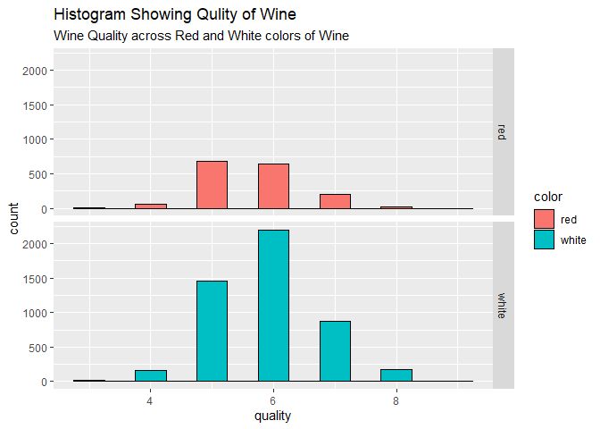

DM\_HW\_4
================
Anuka Revi
4/19/2021

# **Clustering and PCA**

This data wine.csv contains information on 11 chemical properties of
6500 different bottles of *vinho verde* from northern Portugal. I am
trying to present a PCA and K-means clustering model that is capable of
distinguishing the red wine from the white one, using only the
“unsupervised” information contained in the data on chemical
properties. Additionally, we will try to assess whether these models are
capable of distinguishing higher form the lower quality of wine.

Fig1 below shows a histogram of wine quality across red and white wines.
Both colors have approximately normal distribution with higher number of
decent quality wines (quality index between 5 and 7) but there are about
three times as many white wines in the data as red ones.

<table>

<thead>

<tr>

<th style="text-align:right;">

fixed.acidity

</th>

<th style="text-align:right;">

volatile.acidity

</th>

<th style="text-align:right;">

citric.acid

</th>

<th style="text-align:right;">

residual.sugar

</th>

<th style="text-align:right;">

chlorides

</th>

<th style="text-align:right;">

free.sulfur.dioxide

</th>

<th style="text-align:right;">

total.sulfur.dioxide

</th>

<th style="text-align:right;">

density

</th>

<th style="text-align:right;">

pH

</th>

<th style="text-align:right;">

sulphates

</th>

<th style="text-align:right;">

alcohol

</th>

<th style="text-align:right;">

quality

</th>

<th style="text-align:left;">

color

</th>

</tr>

</thead>

<tbody>

<tr>

<td style="text-align:right;">

7.4

</td>

<td style="text-align:right;">

0.70

</td>

<td style="text-align:right;">

0.00

</td>

<td style="text-align:right;">

1.9

</td>

<td style="text-align:right;">

0.076

</td>

<td style="text-align:right;">

11

</td>

<td style="text-align:right;">

34

</td>

<td style="text-align:right;">

0.9978

</td>

<td style="text-align:right;">

3.51

</td>

<td style="text-align:right;">

0.56

</td>

<td style="text-align:right;">

9.4

</td>

<td style="text-align:right;">

5

</td>

<td style="text-align:left;">

red

</td>

</tr>

<tr>

<td style="text-align:right;">

7.8

</td>

<td style="text-align:right;">

0.88

</td>

<td style="text-align:right;">

0.00

</td>

<td style="text-align:right;">

2.6

</td>

<td style="text-align:right;">

0.098

</td>

<td style="text-align:right;">

25

</td>

<td style="text-align:right;">

67

</td>

<td style="text-align:right;">

0.9968

</td>

<td style="text-align:right;">

3.20

</td>

<td style="text-align:right;">

0.68

</td>

<td style="text-align:right;">

9.8

</td>

<td style="text-align:right;">

5

</td>

<td style="text-align:left;">

red

</td>

</tr>

<tr>

<td style="text-align:right;">

7.8

</td>

<td style="text-align:right;">

0.76

</td>

<td style="text-align:right;">

0.04

</td>

<td style="text-align:right;">

2.3

</td>

<td style="text-align:right;">

0.092

</td>

<td style="text-align:right;">

15

</td>

<td style="text-align:right;">

54

</td>

<td style="text-align:right;">

0.9970

</td>

<td style="text-align:right;">

3.26

</td>

<td style="text-align:right;">

0.65

</td>

<td style="text-align:right;">

9.8

</td>

<td style="text-align:right;">

5

</td>

<td style="text-align:left;">

red

</td>

</tr>

<tr>

<td style="text-align:right;">

11.2

</td>

<td style="text-align:right;">

0.28

</td>

<td style="text-align:right;">

0.56

</td>

<td style="text-align:right;">

1.9

</td>

<td style="text-align:right;">

0.075

</td>

<td style="text-align:right;">

17

</td>

<td style="text-align:right;">

60

</td>

<td style="text-align:right;">

0.9980

</td>

<td style="text-align:right;">

3.16

</td>

<td style="text-align:right;">

0.58

</td>

<td style="text-align:right;">

9.8

</td>

<td style="text-align:right;">

6

</td>

<td style="text-align:left;">

red

</td>

</tr>

<tr>

<td style="text-align:right;">

7.4

</td>

<td style="text-align:right;">

0.70

</td>

<td style="text-align:right;">

0.00

</td>

<td style="text-align:right;">

1.9

</td>

<td style="text-align:right;">

0.076

</td>

<td style="text-align:right;">

11

</td>

<td style="text-align:right;">

34

</td>

<td style="text-align:right;">

0.9978

</td>

<td style="text-align:right;">

3.51

</td>

<td style="text-align:right;">

0.56

</td>

<td style="text-align:right;">

9.4

</td>

<td style="text-align:right;">

5

</td>

<td style="text-align:left;">

red

</td>

</tr>

<tr>

<td style="text-align:right;">

7.4

</td>

<td style="text-align:right;">

0.66

</td>

<td style="text-align:right;">

0.00

</td>

<td style="text-align:right;">

1.8

</td>

<td style="text-align:right;">

0.075

</td>

<td style="text-align:right;">

13

</td>

<td style="text-align:right;">

40

</td>

<td style="text-align:right;">

0.9978

</td>

<td style="text-align:right;">

3.51

</td>

<td style="text-align:right;">

0.56

</td>

<td style="text-align:right;">

9.4

</td>

<td style="text-align:right;">

5

</td>

<td style="text-align:left;">

red

</td>

</tr>

</tbody>

</table>

Figure 2 displays boxplot for wine attributes and Correlation Matrix of
these attributes. Boxplot is a useful tool to visualize distribution of
each characteristic(variable) in the wine data set. From the matrix we
see a perfect negative linear relationship between alcohol and density.
Figure 3 shows the relationship between density and alcohol that proves
that its linear and negative.

When we do clustering and PCA we need to normalize values in order to
avoid measurements of different size to distort our analysis. We want
mean of 0 and standard deviation of 1. To evaluate the optimal K for
clustering I’ll use the elbow plot. We should choose a number of
clusters so that adding another cluster does not give much better
partition of the data. In this case the correct number is 3. Thus we can
run K-means algorithm with k=3 (It is important to remember that we are
using normalized data and color variable of interest is not included)

## **PCA for wine analysis**

<!-- --><!-- -->

<table>

<thead>

<tr>

<th style="text-align:left;">

</th>

<th style="text-align:right;">

Dim.1

</th>

<th style="text-align:right;">

Dim.2

</th>

<th style="text-align:right;">

Dim.3

</th>

<th style="text-align:right;">

Dim.4

</th>

<th style="text-align:right;">

Dim.5

</th>

<th style="text-align:right;">

Dim.6

</th>

<th style="text-align:right;">

Dim.7

</th>

<th style="text-align:right;">

Dim.8

</th>

<th style="text-align:right;">

Dim.9

</th>

<th style="text-align:right;">

Dim.10

</th>

<th style="text-align:right;">

Dim.11

</th>

<th style="text-align:right;">

Dim.12

</th>

</tr>

</thead>

<tbody>

<tr>

<td style="text-align:left;">

fixed.acidity

</td>

<td style="text-align:right;">

6.601237

</td>

<td style="text-align:right;">

6.856179

</td>

<td style="text-align:right;">

21.8543338

</td>

<td style="text-align:right;">

2.072557

</td>

<td style="text-align:right;">

2.734479

</td>

<td style="text-align:right;">

0.0902226

</td>

<td style="text-align:right;">

15.4791332

</td>

<td style="text-align:right;">

0.0001335

</td>

<td style="text-align:right;">

17.9919449

</td>

<td style="text-align:right;">

7.421944

</td>

<td style="text-align:right;">

7.6691350

</td>

<td style="text-align:right;">

11.2287005

</td>

</tr>

<tr>

<td style="text-align:left;">

volatile.acidity

</td>

<td style="text-align:right;">

15.597064

</td>

<td style="text-align:right;">

1.106667

</td>

<td style="text-align:right;">

7.8226113

</td>

<td style="text-align:right;">

0.640926

</td>

<td style="text-align:right;">

2.183718

</td>

<td style="text-align:right;">

14.6431530

</td>

<td style="text-align:right;">

19.8123627

</td>

<td style="text-align:right;">

9.6148102

</td>

<td style="text-align:right;">

1.5186419

</td>

<td style="text-align:right;">

24.398289

</td>

<td style="text-align:right;">

1.9824392

</td>

<td style="text-align:right;">

0.6793179

</td>

</tr>

<tr>

<td style="text-align:left;">

citric.acid

</td>

<td style="text-align:right;">

2.145071

</td>

<td style="text-align:right;">

2.076293

</td>

<td style="text-align:right;">

34.5832871

</td>

<td style="text-align:right;">

0.308140

</td>

<td style="text-align:right;">

5.504720

</td>

<td style="text-align:right;">

13.1223893

</td>

<td style="text-align:right;">

0.2275063

</td>

<td style="text-align:right;">

19.7991356

</td>

<td style="text-align:right;">

6.0630517

</td>

<td style="text-align:right;">

10.913468

</td>

<td style="text-align:right;">

5.2567566

</td>

<td style="text-align:right;">

0.0001813

</td>

</tr>

<tr>

<td style="text-align:left;">

residual.sugar

</td>

<td style="text-align:right;">

10.170052

</td>

<td style="text-align:right;">

11.736446

</td>

<td style="text-align:right;">

0.5700507

</td>

<td style="text-align:right;">

1.264640

</td>

<td style="text-align:right;">

25.798393

</td>

<td style="text-align:right;">

0.4009066

</td>

<td style="text-align:right;">

0.9170571

</td>

<td style="text-align:right;">

0.6714955

</td>

<td style="text-align:right;">

23.8167042

</td>

<td style="text-align:right;">

4.292126

</td>

<td style="text-align:right;">

0.0026463

</td>

<td style="text-align:right;">

20.3594821

</td>

</tr>

<tr>

<td style="text-align:left;">

chlorides

</td>

<td style="text-align:right;">

9.825086

</td>

<td style="text-align:right;">

7.277590

</td>

<td style="text-align:right;">

0.2187359

</td>

<td style="text-align:right;">

2.732080

</td>

<td style="text-align:right;">

15.515453

</td>

<td style="text-align:right;">

18.1000994

</td>

<td style="text-align:right;">

22.4009189

</td>

<td style="text-align:right;">

14.1023951

</td>

<td style="text-align:right;">

0.1940381

</td>

<td style="text-align:right;">

5.706011

</td>

<td style="text-align:right;">

3.7402940

</td>

<td style="text-align:right;">

0.1872973

</td>

</tr>

<tr>

<td style="text-align:left;">

free.sulfur.dioxide

</td>

<td style="text-align:right;">

17.866800

</td>

<td style="text-align:right;">

1.236072

</td>

<td style="text-align:right;">

0.9800607

</td>

<td style="text-align:right;">

9.199472

</td>

<td style="text-align:right;">

6.172837

</td>

<td style="text-align:right;">

8.0191006

</td>

<td style="text-align:right;">

13.1561428

</td>

<td style="text-align:right;">

1.4423440

</td>

<td style="text-align:right;">

9.0840050

</td>

<td style="text-align:right;">

9.208085

</td>

<td style="text-align:right;">

23.6349990

</td>

<td style="text-align:right;">

0.0000819

</td>

</tr>

</tbody>

</table>

We see from the PCA model that 3 principle elements explain over 60% of
the data & 8 principle components explain 80% of the data

# **Market Segmentation**

The goal of this project is for NutrientH20 which is a hypothetical
consumer drink brand to understand its social-media audience a little
bit better to maximize appeal to each of their market segment. The
sample was taken from the brand’s Twitter followers (every tweet by its
followers collected over 7 days period in June 2014 and was categorized
based on its content using a pre-specified scheme of 36 different
categories, each representing a broad area of interest (e.g. politics,
sports, family, etc. We will use K-Means clustering to analyze this
data.

### **Data Exploration**

<table>

<thead>

<tr>

<th style="text-align:left;">

X

</th>

<th style="text-align:right;">

chatter

</th>

<th style="text-align:right;">

current\_events

</th>

<th style="text-align:right;">

travel

</th>

<th style="text-align:right;">

photo\_sharing

</th>

<th style="text-align:right;">

uncategorized

</th>

<th style="text-align:right;">

tv\_film

</th>

<th style="text-align:right;">

sports\_fandom

</th>

<th style="text-align:right;">

politics

</th>

<th style="text-align:right;">

food

</th>

<th style="text-align:right;">

family

</th>

<th style="text-align:right;">

home\_and\_garden

</th>

<th style="text-align:right;">

music

</th>

<th style="text-align:right;">

news

</th>

<th style="text-align:right;">

online\_gaming

</th>

<th style="text-align:right;">

shopping

</th>

<th style="text-align:right;">

health\_nutrition

</th>

<th style="text-align:right;">

college\_uni

</th>

<th style="text-align:right;">

sports\_playing

</th>

<th style="text-align:right;">

cooking

</th>

<th style="text-align:right;">

eco

</th>

<th style="text-align:right;">

computers

</th>

<th style="text-align:right;">

business

</th>

<th style="text-align:right;">

outdoors

</th>

<th style="text-align:right;">

crafts

</th>

<th style="text-align:right;">

automotive

</th>

<th style="text-align:right;">

art

</th>

<th style="text-align:right;">

religion

</th>

<th style="text-align:right;">

beauty

</th>

<th style="text-align:right;">

parenting

</th>

<th style="text-align:right;">

dating

</th>

<th style="text-align:right;">

school

</th>

<th style="text-align:right;">

personal\_fitness

</th>

<th style="text-align:right;">

fashion

</th>

<th style="text-align:right;">

small\_business

</th>

<th style="text-align:right;">

spam

</th>

<th style="text-align:right;">

adult

</th>

</tr>

</thead>

<tbody>

<tr>

<td style="text-align:left;">

hmjoe4g3k

</td>

<td style="text-align:right;">

2

</td>

<td style="text-align:right;">

0

</td>

<td style="text-align:right;">

2

</td>

<td style="text-align:right;">

2

</td>

<td style="text-align:right;">

2

</td>

<td style="text-align:right;">

1

</td>

<td style="text-align:right;">

1

</td>

<td style="text-align:right;">

0

</td>

<td style="text-align:right;">

4

</td>

<td style="text-align:right;">

1

</td>

<td style="text-align:right;">

2

</td>

<td style="text-align:right;">

0

</td>

<td style="text-align:right;">

0

</td>

<td style="text-align:right;">

0

</td>

<td style="text-align:right;">

1

</td>

<td style="text-align:right;">

17

</td>

<td style="text-align:right;">

0

</td>

<td style="text-align:right;">

2

</td>

<td style="text-align:right;">

5

</td>

<td style="text-align:right;">

1

</td>

<td style="text-align:right;">

1

</td>

<td style="text-align:right;">

0

</td>

<td style="text-align:right;">

2

</td>

<td style="text-align:right;">

1

</td>

<td style="text-align:right;">

0

</td>

<td style="text-align:right;">

0

</td>

<td style="text-align:right;">

1

</td>

<td style="text-align:right;">

0

</td>

<td style="text-align:right;">

1

</td>

<td style="text-align:right;">

1

</td>

<td style="text-align:right;">

0

</td>

<td style="text-align:right;">

11

</td>

<td style="text-align:right;">

0

</td>

<td style="text-align:right;">

0

</td>

<td style="text-align:right;">

0

</td>

<td style="text-align:right;">

0

</td>

</tr>

<tr>

<td style="text-align:left;">

clk1m5w8s

</td>

<td style="text-align:right;">

3

</td>

<td style="text-align:right;">

3

</td>

<td style="text-align:right;">

2

</td>

<td style="text-align:right;">

1

</td>

<td style="text-align:right;">

1

</td>

<td style="text-align:right;">

1

</td>

<td style="text-align:right;">

4

</td>

<td style="text-align:right;">

1

</td>

<td style="text-align:right;">

2

</td>

<td style="text-align:right;">

2

</td>

<td style="text-align:right;">

1

</td>

<td style="text-align:right;">

0

</td>

<td style="text-align:right;">

0

</td>

<td style="text-align:right;">

0

</td>

<td style="text-align:right;">

0

</td>

<td style="text-align:right;">

0

</td>

<td style="text-align:right;">

0

</td>

<td style="text-align:right;">

1

</td>

<td style="text-align:right;">

0

</td>

<td style="text-align:right;">

0

</td>

<td style="text-align:right;">

0

</td>

<td style="text-align:right;">

1

</td>

<td style="text-align:right;">

0

</td>

<td style="text-align:right;">

2

</td>

<td style="text-align:right;">

0

</td>

<td style="text-align:right;">

0

</td>

<td style="text-align:right;">

0

</td>

<td style="text-align:right;">

0

</td>

<td style="text-align:right;">

0

</td>

<td style="text-align:right;">

1

</td>

<td style="text-align:right;">

4

</td>

<td style="text-align:right;">

0

</td>

<td style="text-align:right;">

0

</td>

<td style="text-align:right;">

0

</td>

<td style="text-align:right;">

0

</td>

<td style="text-align:right;">

0

</td>

</tr>

<tr>

<td style="text-align:left;">

jcsovtak3

</td>

<td style="text-align:right;">

6

</td>

<td style="text-align:right;">

3

</td>

<td style="text-align:right;">

4

</td>

<td style="text-align:right;">

3

</td>

<td style="text-align:right;">

1

</td>

<td style="text-align:right;">

5

</td>

<td style="text-align:right;">

0

</td>

<td style="text-align:right;">

2

</td>

<td style="text-align:right;">

1

</td>

<td style="text-align:right;">

1

</td>

<td style="text-align:right;">

1

</td>

<td style="text-align:right;">

1

</td>

<td style="text-align:right;">

1

</td>

<td style="text-align:right;">

0

</td>

<td style="text-align:right;">

2

</td>

<td style="text-align:right;">

0

</td>

<td style="text-align:right;">

0

</td>

<td style="text-align:right;">

0

</td>

<td style="text-align:right;">

2

</td>

<td style="text-align:right;">

1

</td>

<td style="text-align:right;">

0

</td>

<td style="text-align:right;">

0

</td>

<td style="text-align:right;">

0

</td>

<td style="text-align:right;">

2

</td>

<td style="text-align:right;">

0

</td>

<td style="text-align:right;">

8

</td>

<td style="text-align:right;">

0

</td>

<td style="text-align:right;">

1

</td>

<td style="text-align:right;">

0

</td>

<td style="text-align:right;">

1

</td>

<td style="text-align:right;">

0

</td>

<td style="text-align:right;">

0

</td>

<td style="text-align:right;">

1

</td>

<td style="text-align:right;">

0

</td>

<td style="text-align:right;">

0

</td>

<td style="text-align:right;">

0

</td>

</tr>

<tr>

<td style="text-align:left;">

3oeb4hiln

</td>

<td style="text-align:right;">

1

</td>

<td style="text-align:right;">

5

</td>

<td style="text-align:right;">

2

</td>

<td style="text-align:right;">

2

</td>

<td style="text-align:right;">

0

</td>

<td style="text-align:right;">

1

</td>

<td style="text-align:right;">

0

</td>

<td style="text-align:right;">

1

</td>

<td style="text-align:right;">

0

</td>

<td style="text-align:right;">

1

</td>

<td style="text-align:right;">

0

</td>

<td style="text-align:right;">

0

</td>

<td style="text-align:right;">

0

</td>

<td style="text-align:right;">

0

</td>

<td style="text-align:right;">

0

</td>

<td style="text-align:right;">

0

</td>

<td style="text-align:right;">

1

</td>

<td style="text-align:right;">

0

</td>

<td style="text-align:right;">

0

</td>

<td style="text-align:right;">

0

</td>

<td style="text-align:right;">

0

</td>

<td style="text-align:right;">

1

</td>

<td style="text-align:right;">

0

</td>

<td style="text-align:right;">

3

</td>

<td style="text-align:right;">

0

</td>

<td style="text-align:right;">

2

</td>

<td style="text-align:right;">

0

</td>

<td style="text-align:right;">

1

</td>

<td style="text-align:right;">

0

</td>

<td style="text-align:right;">

0

</td>

<td style="text-align:right;">

0

</td>

<td style="text-align:right;">

0

</td>

<td style="text-align:right;">

0

</td>

<td style="text-align:right;">

0

</td>

<td style="text-align:right;">

0

</td>

<td style="text-align:right;">

0

</td>

</tr>

<tr>

<td style="text-align:left;">

fd75x1vgk

</td>

<td style="text-align:right;">

5

</td>

<td style="text-align:right;">

2

</td>

<td style="text-align:right;">

0

</td>

<td style="text-align:right;">

6

</td>

<td style="text-align:right;">

1

</td>

<td style="text-align:right;">

0

</td>

<td style="text-align:right;">

0

</td>

<td style="text-align:right;">

2

</td>

<td style="text-align:right;">

0

</td>

<td style="text-align:right;">

1

</td>

<td style="text-align:right;">

0

</td>

<td style="text-align:right;">

0

</td>

<td style="text-align:right;">

0

</td>

<td style="text-align:right;">

3

</td>

<td style="text-align:right;">

2

</td>

<td style="text-align:right;">

0

</td>

<td style="text-align:right;">

4

</td>

<td style="text-align:right;">

0

</td>

<td style="text-align:right;">

1

</td>

<td style="text-align:right;">

0

</td>

<td style="text-align:right;">

1

</td>

<td style="text-align:right;">

0

</td>

<td style="text-align:right;">

1

</td>

<td style="text-align:right;">

0

</td>

<td style="text-align:right;">

0

</td>

<td style="text-align:right;">

0

</td>

<td style="text-align:right;">

0

</td>

<td style="text-align:right;">

0

</td>

<td style="text-align:right;">

0

</td>

<td style="text-align:right;">

0

</td>

<td style="text-align:right;">

0

</td>

<td style="text-align:right;">

0

</td>

<td style="text-align:right;">

0

</td>

<td style="text-align:right;">

1

</td>

<td style="text-align:right;">

0

</td>

<td style="text-align:right;">

0

</td>

</tr>

<tr>

<td style="text-align:left;">

h6nvj91yp

</td>

<td style="text-align:right;">

6

</td>

<td style="text-align:right;">

4

</td>

<td style="text-align:right;">

2

</td>

<td style="text-align:right;">

7

</td>

<td style="text-align:right;">

0

</td>

<td style="text-align:right;">

1

</td>

<td style="text-align:right;">

1

</td>

<td style="text-align:right;">

0

</td>

<td style="text-align:right;">

2

</td>

<td style="text-align:right;">

1

</td>

<td style="text-align:right;">

1

</td>

<td style="text-align:right;">

1

</td>

<td style="text-align:right;">

0

</td>

<td style="text-align:right;">

0

</td>

<td style="text-align:right;">

5

</td>

<td style="text-align:right;">

0

</td>

<td style="text-align:right;">

0

</td>

<td style="text-align:right;">

0

</td>

<td style="text-align:right;">

0

</td>

<td style="text-align:right;">

0

</td>

<td style="text-align:right;">

1

</td>

<td style="text-align:right;">

1

</td>

<td style="text-align:right;">

0

</td>

<td style="text-align:right;">

0

</td>

<td style="text-align:right;">

1

</td>

<td style="text-align:right;">

0

</td>

<td style="text-align:right;">

0

</td>

<td style="text-align:right;">

0

</td>

<td style="text-align:right;">

0

</td>

<td style="text-align:right;">

0

</td>

<td style="text-align:right;">

0

</td>

<td style="text-align:right;">

0

</td>

<td style="text-align:right;">

0

</td>

<td style="text-align:right;">

0

</td>

<td style="text-align:right;">

0

</td>

<td style="text-align:right;">

0

</td>

</tr>

</tbody>

</table>

<!-- -->

First thing we are looking at the correlation matrix and we see that
some variables are strongly correlated. some of the most correlated
variables are: -\> online\_gaming and college\_uni -\> health nutrition
& personal fitness -\> cooking with fashion and beauty -\> religion with
parenting

### **K-Means Clustering**

K-means clustering requires normalization of the data. I show elbow
method to analyze what K-value is the most optimal for our data but it
is not very helpful. According to the elbow plot we would go with 2
clusters but with given number of different market segments that
wouldnot be enough. So I arbitrarily chose K=5.

<!-- -->

In order to identify which cluster belongs to which type of market
segment(customer profiles) we need to apply these clusters to the median
number of tweets in the original marketing data.

<table>

<thead>

<tr>

<th style="text-align:right;">

cluster

</th>

<th style="text-align:right;">

current\_events

</th>

<th style="text-align:right;">

travel

</th>

<th style="text-align:right;">

photo\_sharing

</th>

<th style="text-align:right;">

uncategorized

</th>

<th style="text-align:right;">

tv\_film

</th>

<th style="text-align:right;">

sports\_fandom

</th>

<th style="text-align:right;">

politics

</th>

<th style="text-align:right;">

food

</th>

<th style="text-align:right;">

family

</th>

<th style="text-align:right;">

home\_and\_garden

</th>

<th style="text-align:right;">

music

</th>

<th style="text-align:right;">

news

</th>

<th style="text-align:right;">

online\_gaming

</th>

<th style="text-align:right;">

shopping

</th>

<th style="text-align:right;">

health\_nutrition

</th>

<th style="text-align:right;">

college\_uni

</th>

<th style="text-align:right;">

sports\_playing

</th>

<th style="text-align:right;">

cooking

</th>

<th style="text-align:right;">

eco

</th>

<th style="text-align:right;">

computers

</th>

<th style="text-align:right;">

business

</th>

<th style="text-align:right;">

outdoors

</th>

<th style="text-align:right;">

crafts

</th>

<th style="text-align:right;">

automotive

</th>

<th style="text-align:right;">

art

</th>

<th style="text-align:right;">

religion

</th>

<th style="text-align:right;">

beauty

</th>

<th style="text-align:right;">

parenting

</th>

<th style="text-align:right;">

dating

</th>

<th style="text-align:right;">

school

</th>

<th style="text-align:right;">

personal\_fitness

</th>

<th style="text-align:right;">

fashion

</th>

<th style="text-align:right;">

small\_business

</th>

<th style="text-align:right;">

spam

</th>

<th style="text-align:right;">

adult

</th>

</tr>

</thead>

<tbody>

<tr>

<td style="text-align:right;">

1

</td>

<td style="text-align:right;">

1.512644

</td>

<td style="text-align:right;">

1.231035

</td>

<td style="text-align:right;">

2.555172

</td>

<td style="text-align:right;">

0.9517241

</td>

<td style="text-align:right;">

0.8977011

</td>

<td style="text-align:right;">

1.1781609

</td>

<td style="text-align:right;">

1.2402299

</td>

<td style="text-align:right;">

2.1701149

</td>

<td style="text-align:right;">

0.7781609

</td>

<td style="text-align:right;">

0.6241379

</td>

<td style="text-align:right;">

0.7011494

</td>

<td style="text-align:right;">

1.1402299

</td>

<td style="text-align:right;">

1.0402299

</td>

<td style="text-align:right;">

1.3781609

</td>

<td style="text-align:right;">

12.265517

</td>

<td style="text-align:right;">

1.088506

</td>

<td style="text-align:right;">

0.6574713

</td>

<td style="text-align:right;">

3.4850575

</td>

<td style="text-align:right;">

0.9206897

</td>

<td style="text-align:right;">

0.5528736

</td>

<td style="text-align:right;">

0.4425287

</td>

<td style="text-align:right;">

2.7908046

</td>

<td style="text-align:right;">

0.5839080

</td>

<td style="text-align:right;">

0.6540230

</td>

<td style="text-align:right;">

0.6977011

</td>

<td style="text-align:right;">

0.7758621

</td>

<td style="text-align:right;">

0.4804598

</td>

<td style="text-align:right;">

0.7620690

</td>

<td style="text-align:right;">

0.9988506

</td>

<td style="text-align:right;">

0.5597701

</td>

<td style="text-align:right;">

6.5597701

</td>

<td style="text-align:right;">

0.8563218

</td>

<td style="text-align:right;">

0.2551724

</td>

<td style="text-align:right;">

0.0068966

</td>

<td style="text-align:right;">

0.3781609

</td>

</tr>

<tr>

<td style="text-align:right;">

2

</td>

<td style="text-align:right;">

1.674324

</td>

<td style="text-align:right;">

1.359460

</td>

<td style="text-align:right;">

2.520270

</td>

<td style="text-align:right;">

0.7405405

</td>

<td style="text-align:right;">

1.0621622

</td>

<td style="text-align:right;">

6.0229730

</td>

<td style="text-align:right;">

1.1851351

</td>

<td style="text-align:right;">

4.6283784

</td>

<td style="text-align:right;">

2.5567568

</td>

<td style="text-align:right;">

0.6459459

</td>

<td style="text-align:right;">

0.7297297

</td>

<td style="text-align:right;">

1.0648649

</td>

<td style="text-align:right;">

1.2770270

</td>

<td style="text-align:right;">

1.3878378

</td>

<td style="text-align:right;">

1.871622

</td>

<td style="text-align:right;">

1.455405

</td>

<td style="text-align:right;">

0.7810811

</td>

<td style="text-align:right;">

1.6986486

</td>

<td style="text-align:right;">

0.6445946

</td>

<td style="text-align:right;">

0.7391892

</td>

<td style="text-align:right;">

0.5067568

</td>

<td style="text-align:right;">

0.6986486

</td>

<td style="text-align:right;">

1.0918919

</td>

<td style="text-align:right;">

1.0648649

</td>

<td style="text-align:right;">

0.8986486

</td>

<td style="text-align:right;">

5.4148649

</td>

<td style="text-align:right;">

1.1202703

</td>

<td style="text-align:right;">

4.1378378

</td>

<td style="text-align:right;">

0.6905405

</td>

<td style="text-align:right;">

2.7378378

</td>

<td style="text-align:right;">

1.2256757

</td>

<td style="text-align:right;">

1.0472973

</td>

<td style="text-align:right;">

0.3945946

</td>

<td style="text-align:right;">

0.0054054

</td>

<td style="text-align:right;">

0.4351351

</td>

</tr>

<tr>

<td style="text-align:right;">

3

</td>

<td style="text-align:right;">

1.656716

</td>

<td style="text-align:right;">

5.808955

</td>

<td style="text-align:right;">

2.398508

</td>

<td style="text-align:right;">

0.7701493

</td>

<td style="text-align:right;">

1.1208955

</td>

<td style="text-align:right;">

2.0059701

</td>

<td style="text-align:right;">

9.1641791

</td>

<td style="text-align:right;">

1.4597015

</td>

<td style="text-align:right;">

0.9194030

</td>

<td style="text-align:right;">

0.6119403

</td>

<td style="text-align:right;">

0.6283582

</td>

<td style="text-align:right;">

5.2641791

</td>

<td style="text-align:right;">

1.0164179

</td>

<td style="text-align:right;">

1.2880597

</td>

<td style="text-align:right;">

1.655224

</td>

<td style="text-align:right;">

1.471642

</td>

<td style="text-align:right;">

0.6671642

</td>

<td style="text-align:right;">

1.3373134

</td>

<td style="text-align:right;">

0.5865672

</td>

<td style="text-align:right;">

2.5835821

</td>

<td style="text-align:right;">

0.6462687

</td>

<td style="text-align:right;">

0.9104478

</td>

<td style="text-align:right;">

0.5985075

</td>

<td style="text-align:right;">

2.2880597

</td>

<td style="text-align:right;">

0.6313433

</td>

<td style="text-align:right;">

1.0373134

</td>

<td style="text-align:right;">

0.5014925

</td>

<td style="text-align:right;">

0.9537313

</td>

<td style="text-align:right;">

1.0761194

</td>

<td style="text-align:right;">

0.7134328

</td>

<td style="text-align:right;">

0.9895522

</td>

<td style="text-align:right;">

0.7059701

</td>

<td style="text-align:right;">

0.4761194

</td>

<td style="text-align:right;">

0.0074627

</td>

<td style="text-align:right;">

0.2373134

</td>

</tr>

<tr>

<td style="text-align:right;">

4

</td>

<td style="text-align:right;">

1.362176

</td>

<td style="text-align:right;">

1.049616

</td>

<td style="text-align:right;">

1.839885

</td>

<td style="text-align:right;">

0.6572387

</td>

<td style="text-align:right;">

0.8226270

</td>

<td style="text-align:right;">

0.9508629

</td>

<td style="text-align:right;">

0.9623682

</td>

<td style="text-align:right;">

0.7473634

</td>

<td style="text-align:right;">

0.5568073

</td>

<td style="text-align:right;">

0.3947747

</td>

<td style="text-align:right;">

0.4717162

</td>

<td style="text-align:right;">

0.6845638

</td>

<td style="text-align:right;">

0.8681687

</td>

<td style="text-align:right;">

0.9530201

</td>

<td style="text-align:right;">

1.085810

</td>

<td style="text-align:right;">

1.093720

</td>

<td style="text-align:right;">

0.4374401

</td>

<td style="text-align:right;">

0.8307766

</td>

<td style="text-align:right;">

0.3302972

</td>

<td style="text-align:right;">

0.3511505

</td>

<td style="text-align:right;">

0.2778044

</td>

<td style="text-align:right;">

0.4010067

</td>

<td style="text-align:right;">

0.3053691

</td>

<td style="text-align:right;">

0.5476989

</td>

<td style="text-align:right;">

0.4676414

</td>

<td style="text-align:right;">

0.5129434

</td>

<td style="text-align:right;">

0.3190316

</td>

<td style="text-align:right;">

0.4489453

</td>

<td style="text-align:right;">

0.4074784

</td>

<td style="text-align:right;">

0.4043624

</td>

<td style="text-align:right;">

0.6347076

</td>

<td style="text-align:right;">

0.4578140

</td>

<td style="text-align:right;">

0.2245925

</td>

<td style="text-align:right;">

0.0059923

</td>

<td style="text-align:right;">

0.3933365

</td>

</tr>

<tr>

<td style="text-align:right;">

5

</td>

<td style="text-align:right;">

1.875525

</td>

<td style="text-align:right;">

1.500000

</td>

<td style="text-align:right;">

5.513986

</td>

<td style="text-align:right;">

1.2405594

</td>

<td style="text-align:right;">

1.8783217

</td>

<td style="text-align:right;">

1.2384615

</td>

<td style="text-align:right;">

1.3895105

</td>

<td style="text-align:right;">

1.1230769

</td>

<td style="text-align:right;">

0.9097902

</td>

<td style="text-align:right;">

0.7174825

</td>

<td style="text-align:right;">

1.2692308

</td>

<td style="text-align:right;">

0.9363636

</td>

<td style="text-align:right;">

2.3601399

</td>

<td style="text-align:right;">

2.7174825

</td>

<td style="text-align:right;">

1.776224

</td>

<td style="text-align:right;">

3.244755

</td>

<td style="text-align:right;">

1.1300699

</td>

<td style="text-align:right;">

4.9643357

</td>

<td style="text-align:right;">

0.6916084

</td>

<td style="text-align:right;">

0.6237762

</td>

<td style="text-align:right;">

0.6881119

</td>

<td style="text-align:right;">

0.6580420

</td>

<td style="text-align:right;">

0.7517483

</td>

<td style="text-align:right;">

0.9552448

</td>

<td style="text-align:right;">

1.4454545

</td>

<td style="text-align:right;">

0.7811189

</td>

<td style="text-align:right;">

1.8489510

</td>

<td style="text-align:right;">

0.7167832

</td>

<td style="text-align:right;">

1.2601399

</td>

<td style="text-align:right;">

0.9601399

</td>

<td style="text-align:right;">

1.1181818

</td>

<td style="text-align:right;">

2.7636364

</td>

<td style="text-align:right;">

0.6160839

</td>

<td style="text-align:right;">

0.0076923

</td>

<td style="text-align:right;">

0.5090909

</td>

</tr>

</tbody>

</table>

In summary applying K-means clusters with K=5 gives us different
segments, in cluster 1 we see people who are into personal fitness,
outdoors, eco-friendly, into health nutrition; in Cluster 2 we have
people who are more family oriented into sports, food, family, crafts,
religion, parenting, school, Cluster 3 are people who like to travel ,
are into politics, news, automotive; Cluster 4 has no people who are
characterized with given labels and Cluster 5 has most diverse groups
who are into current events, photo sharing, tv\_films, home and garden,
music, online gaming, shopping, college-university, sports playing,
business, art, dating, fashion and adult industry (Cluster 5 cluster
seems to have aggregated many diverse segments into 1 category and maybe
using more than 5 clusters would be useful in future to perform similar
analysis)

# **Association Rules for Grocery Purchases**

Market Basket analysis is one the key techniques used by large retailers
to uncover associations between items. In this project we are presented
with the data file which is a list of shopping baskets: one person’s
basket for each row, with multiple items per row separated by commas. We
have 15297 transactions and 170 columns. So we have 170 product
descriptions involved in the dataset and 15297 collections of these
items.

Graph below depicts Item Frequency Plot. This shows that whole milk has
the highest sales. If the grocery store wanted to increase sales for
yogurt, it would be reasonable to put it next to milk. Discovered item
sets make sense, when people shop they tendto buy products that are in
the same isle (butter& milk; vegetables and fruits) or go well together
(bread, butter).

<!-- -->

### \> **Generating Rules**

We will use *APRIORI* algorithm in package *arules*. My specified Min
support threshold will be 0.001, confidence level will be 0.4 (Higher
confidence level gives very few associations, so I decided to choose the
more optimal number)

    ##     lhs                         rhs            support     confidence
    ## [1] {liquor,red/blush wine}  => {bottled beer} 0.001045957 0.9411765 
    ## [2] {curd,tropical fruit}    => {whole milk}   0.001503563 0.5227273 
    ## [3] {butter,root vegetables} => {whole milk}   0.002091913 0.5161290 
    ##     coverage    lift      count
    ## [1] 0.001111329 18.178253 16   
    ## [2] 0.002876381  3.181918 23   
    ## [3] 0.004053082  3.141753 32

<table>

<thead>

<tr>

<th style="text-align:left;">

</th>

<th style="text-align:left;">

lhs

</th>

<th style="text-align:left;">

</th>

<th style="text-align:left;">

rhs

</th>

<th style="text-align:right;">

support

</th>

<th style="text-align:right;">

confidence

</th>

<th style="text-align:right;">

coverage

</th>

<th style="text-align:right;">

lift

</th>

<th style="text-align:right;">

count

</th>

</tr>

</thead>

<tbody>

<tr>

<td style="text-align:left;">

\[1\]

</td>

<td style="text-align:left;">

{liquor,red/blush wine}

</td>

<td style="text-align:left;">

\=\>

</td>

<td style="text-align:left;">

{bottled beer}

</td>

<td style="text-align:right;">

0.0010460

</td>

<td style="text-align:right;">

0.9411765

</td>

<td style="text-align:right;">

0.0011113

</td>

<td style="text-align:right;">

18.178253

</td>

<td style="text-align:right;">

16

</td>

</tr>

<tr>

<td style="text-align:left;">

\[2\]

</td>

<td style="text-align:left;">

{curd,tropical fruit}

</td>

<td style="text-align:left;">

\=\>

</td>

<td style="text-align:left;">

{whole milk}

</td>

<td style="text-align:right;">

0.0015036

</td>

<td style="text-align:right;">

0.5227273

</td>

<td style="text-align:right;">

0.0028764

</td>

<td style="text-align:right;">

3.181918

</td>

<td style="text-align:right;">

23

</td>

</tr>

<tr>

<td style="text-align:left;">

\[3\]

</td>

<td style="text-align:left;">

{butter,root vegetables}

</td>

<td style="text-align:left;">

\=\>

</td>

<td style="text-align:left;">

{whole milk}

</td>

<td style="text-align:right;">

0.0020919

</td>

<td style="text-align:right;">

0.5161290

</td>

<td style="text-align:right;">

0.0040531

</td>

<td style="text-align:right;">

3.141753

</td>

<td style="text-align:right;">

32

</td>

</tr>

</tbody>

</table>

  - 94% of customers who bought **liquor,red/blush wine** also bought
    **bottled beer**
  - 52% of customers who bough curd, tropical fruit also bought whole
    milk, also 51% who bought butter,root vegetables also bought whole
    milk. As wee see whole milk is generally producing the highest
    sales. interactive visualized graphs are plotted below. It is easy
    to see that the strongest association is bwteen drinks wine and
    beer. Curd, other vegetables as well as milk products such as butter
    also are associated with whole milk.

    ## Available control parameters (with default values):
    ## main  =  Graph for 10 rules
    ## max   =  100
    ## nodeCol   =  c("#EE0000FF", "#EE0303FF", "#EE0606FF", "#EE0909FF", "#EE0C0CFF", "#EE0F0FFF", "#EE1212FF", "#EE1515FF", "#EE1818FF", "#EE1B1BFF", "#EE1E1EFF", "#EE2222FF", "#EE2525FF", "#EE2828FF", "#EE2B2BFF", "#EE2E2EFF", "#EE3131FF", "#EE3434FF", "#EE3737FF", "#EE3A3AFF", "#EE3D3DFF", "#EE4040FF", "#EE4444FF", "#EE4747FF", "#EE4A4AFF", "#EE4D4DFF", "#EE5050FF", "#EE5353FF", "#EE5656FF", "#EE5959FF", "#EE5C5CFF", "#EE5F5FFF", "#EE6262FF", "#EE6666FF", "#EE6969FF", "#EE6C6CFF", "#EE6F6FFF", "#EE7272FF", "#EE7575FF",  "#EE7878FF", "#EE7B7BFF", "#EE7E7EFF", "#EE8181FF", "#EE8484FF", "#EE8888FF", "#EE8B8BFF", "#EE8E8EFF", "#EE9191FF", "#EE9494FF", "#EE9797FF", "#EE9999FF", "#EE9B9BFF", "#EE9D9DFF", "#EE9F9FFF", "#EEA0A0FF", "#EEA2A2FF", "#EEA4A4FF", "#EEA5A5FF", "#EEA7A7FF", "#EEA9A9FF", "#EEABABFF", "#EEACACFF", "#EEAEAEFF", "#EEB0B0FF", "#EEB1B1FF", "#EEB3B3FF", "#EEB5B5FF", "#EEB7B7FF", "#EEB8B8FF", "#EEBABAFF", "#EEBCBCFF", "#EEBDBDFF", "#EEBFBFFF", "#EEC1C1FF", "#EEC3C3FF", "#EEC4C4FF", "#EEC6C6FF", "#EEC8C8FF",  "#EEC9C9FF", "#EECBCBFF", "#EECDCDFF", "#EECFCFFF", "#EED0D0FF", "#EED2D2FF", "#EED4D4FF", "#EED5D5FF", "#EED7D7FF", "#EED9D9FF", "#EEDBDBFF", "#EEDCDCFF", "#EEDEDEFF", "#EEE0E0FF", "#EEE1E1FF", "#EEE3E3FF", "#EEE5E5FF", "#EEE7E7FF", "#EEE8E8FF", "#EEEAEAFF", "#EEECECFF", "#EEEEEEFF")
    ## itemnodeCol   =  #66CC66FF
    ## edgeCol   =  #ABABABFF
    ## labelCol  =  #000000B3
    ## itemLabels    =  TRUE
    ## measureLabels     =  FALSE
    ## precision     =  3
    ## arrowSize     =  0.5
    ## alpha     =  0.5
    ## cex   =  1
    ## layout    =  NULL
    ## layoutParams  =  list()
    ## engine    =  igraph
    ## plot  =  TRUE
    ## plot_options  =  list()
    ## verbose   =  FALSE

<!-- -->
